<div align="center">
    <h1>👮‍♂️ TryHackMe Brooklyn Nine Nine Writeup 🔫</h1>
</div>
<p align="center">
  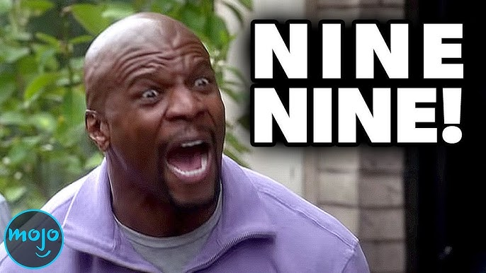
</p>

## 🚀 1. Khởi động target

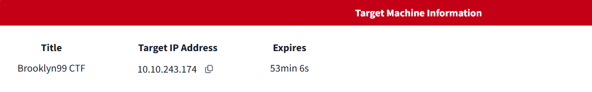

## 🔍 2. Recon

- Taget là một trang web tĩnh chỉ bao gồm poster của show `Brooklyn Nine Nine` (Good show, highly recommend :)))

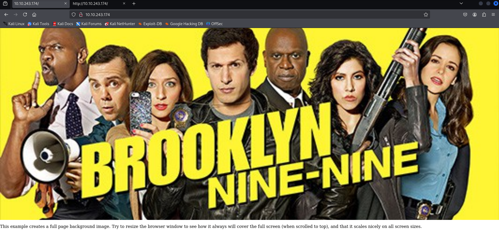

- Sử dụng `nmap` quét cổng.

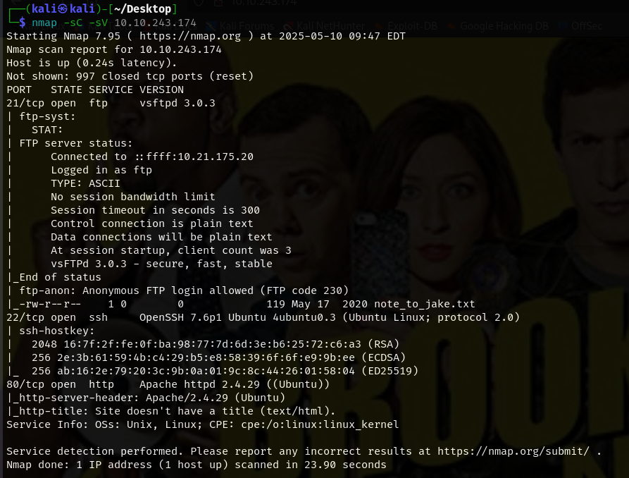

- Đáng chú ý ở đây ngoài port `80` cho http và `22` cho ssh thì port `21` cho `ftp` cũng đang mở.
- Port `21` cho phép đăng nhập `ftp` bằng `anonymous` và còn tiết lộ một file tên `note_to_jake.txt`.

- Tìm thư mục ẩn cũng không phát hiện gì đặc biệt

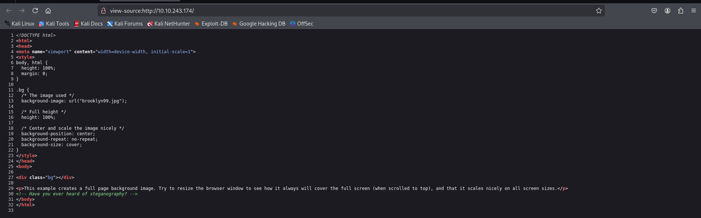

- Đoc mã nguồn trang web, phát hiện một đoạn note gợi ý về `steganography`.

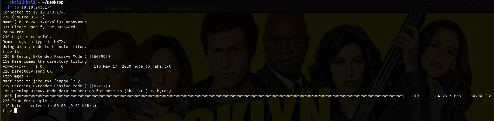

## 🔑3. Khai thác sâu hơn

- Đăng nhập thành công và tải file `note_to_jake.txt` qua `ftp`.

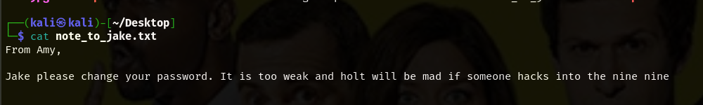

- Đây là đoạn note của Amy cho Jake về việc mật khẩu của ông nầy quá yếu => có thể bruteforce ??.

- Vì ta được gợi ý ở trên có liên quan đến `steganography` mà trang web trên chỉ có đúng một hình ảnh là poster kể trên, thử tải về và tìm tin giấu trong ảnh.


- Có vẻ nó cần mật khẩu để giải mã. 

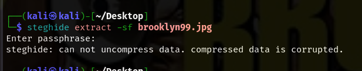

- Sử dụng `stegcracker` để crack password

```bash
stegcracker brooklyn99.jpg /usr/share/wordlists/rockyou.txt
```

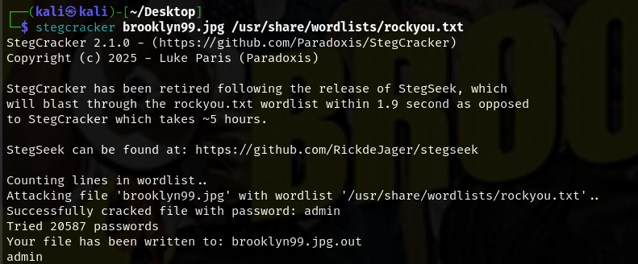

- Crack thành công, đọc file `brooklyn99.jpg.out` để xem kết quả.

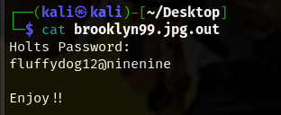

=> Thành công lấy được mật khẩu của Holt.


</div>
<p align="center">
  
</p>

- Tuy nhiên đừng quên lời nhắc của Amy phía trên, ta có thể khai thác thêm mật khảu của Jake bằng cách brute force.

- Có thể đoán được đây là mật khẩu `ssh` vì vậy vét cạn thông qua dịch vụ này sử dụng `hydra`:

```bash
hydra -l jake -P /usr/share/wordlists/rockyou.txt ssh://10.10.243.174 -V 
```

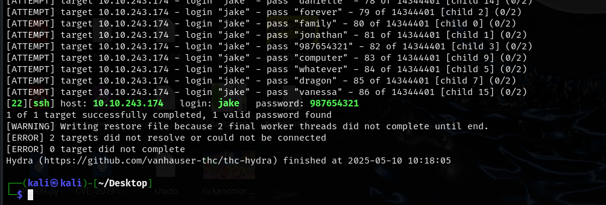

=> Thành công lấy được mật khẩu của cả Jake.

</div>
<p align="center">
  
</p>

- Đăng nhập `ssh` thành công thông qua tài khoản captain Holt.

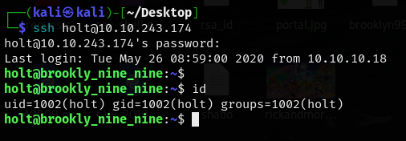

- Thành công lấy được user flag 🚩🚩🚩.

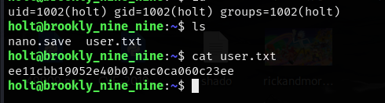

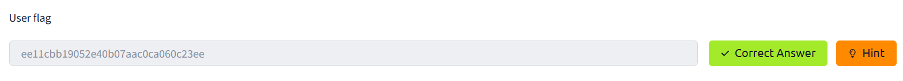

- Nâng quyền root để đọc được flag thứ hai. Kiểm tra các lệnh có thể chạy với root mà không cần mật khẩu bằng `sudo -l`

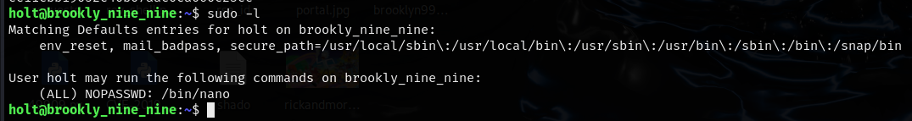

- Có thể chạy nano, thử kiếm tra trên https://gtfobins.github.io/ xem có lệnh leo quyền không.

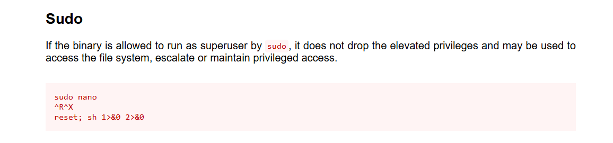

- Làm theo hướng dẫn, chạy `sudo nano`, sau đó `ctrl+R và ctrl+x` rồi nhập lệnh `reset; sh 1>&0 2>&0`.

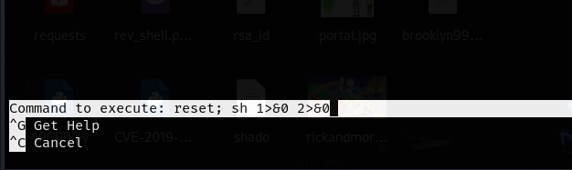

- Thành công vào được root bên trong `nano`.

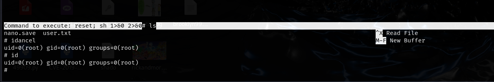

- Cuối cùng là đọc file `root.txt` và hoàn thành root flag 🚩🚩🚩

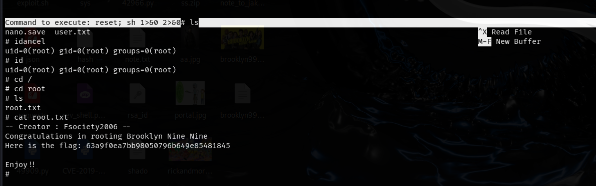

- Hoàn thành bài lab 🔥🔥🔥

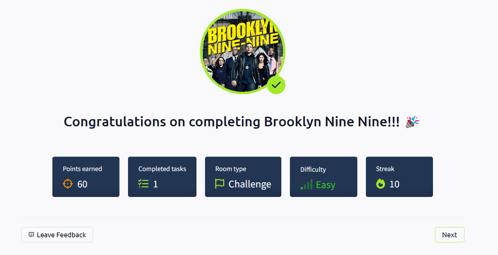

</div>
<p align="center">
  
</p>
