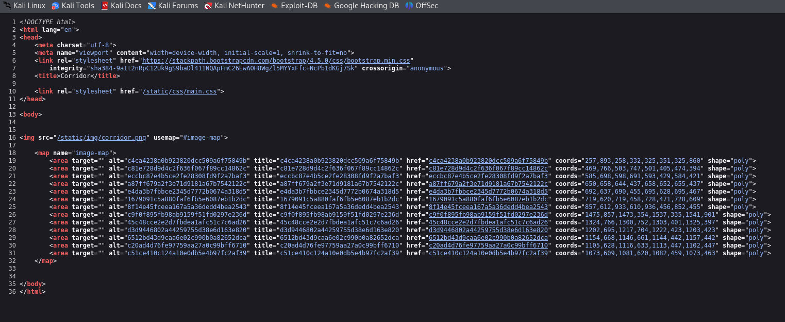
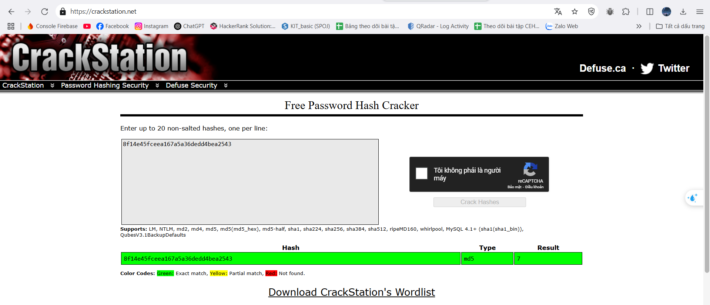
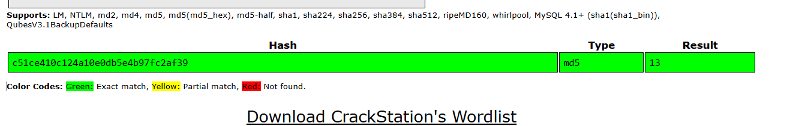
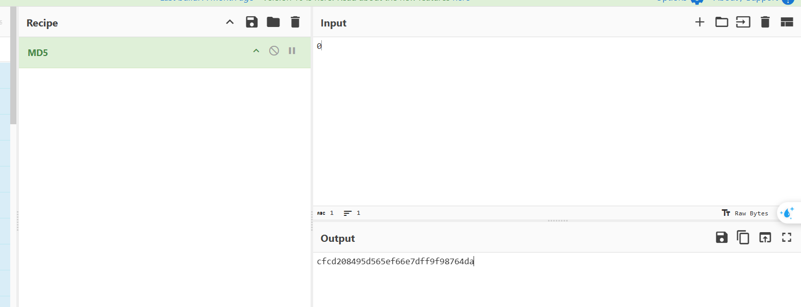
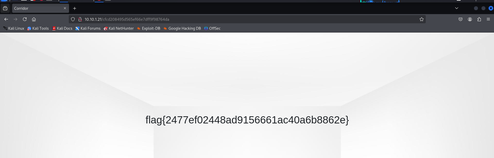
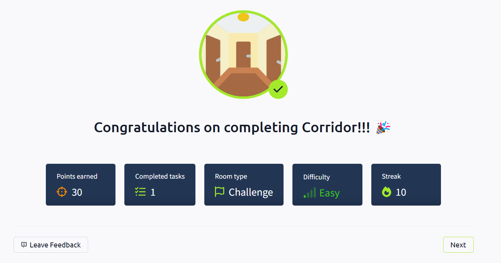

<div align="center">
    <h1> 🚪TryHackMe Corridor Writeup 🔐</h1>
</div>

## Giới thiệu

- Room này là một bài lab cực kì đơn giản liên quan đến lỗ hổng `IDOR`.

- Lỗ hổng `IDOR` (Insecure Direct Object Reference) là một lỗ hổng bảo mật thuộc nhóm `Broken Access Control`, xảy ra khi một ứng dụng web cho phép người dùng truy cập trực tiếp đến các đối tượng (tệp tin, bản ghi cơ sở dữ liệu, thông tin tài khoản, v.v.) thông qua các tham chiếu như ID mà không kiểm tra đầy đủ quyền truy cập. 

- Ví dụ minh họa: Giả sử có một trang web cho phép người dùng xem hóa đơn cá nhân với đường dẫn:
```
https://shop.com/invoice?id=1001
```
- Bạn đăng nhập tài khoản của mình và được cấp quyền xem hóa đơn id=1001.

- Tuy nhiên, nếu bạn thay đổi id=1001 thành id=1002, và hệ thống không kiểm tra quyền truy cập, bạn có thể xem hóa đơn của người dùng khác – điều này là `IDOR`.


## 🚀 Khởi động taget


## 🔐 Tìm flag

- Truy cập trang web, xuất hiện một giao diện gồm nhiều cánh cửa. (The Shining ??)


- Xem mã nguồn, có vẻ các cánh cửa này có thể tương tác.



- Thử nhấn vào một cánh cửa.


- Giao diện đơn giản là một phòng trống, tuy nhiên nếu để ý thì mỗi phòng sẽ tương ứng với một đoạn mã trên đường dẫn.

- Với phòng trên là `8f14e45fceea167a5a36dedd4bea2543`

- Đây có vẻ là mã `hash` `MD5`, thử giải mã sử dụng crackstation.net



- Mã hash này tương ứng với số `7`



- Giải mã một số hash code trong các phòng, có thể đoán được mỗi phòng tương ứng với một số, lớn nhất là `13`.

- Thử tự tạo mã hash với những số không được truy cập thông qua các cách cửa thì thấy hoàn toàn thành công mà không gặp lỗi nào. => `IDOR`

- `Tryhackme` room thường cài cắm gì đó ở số `0` khi liên quan đến `IDOR`



- Tạo Md5 hash code với số `0` và truy cập thử



- Thành công lấy được flag.



=> Hoàn thành bài lab 🔥🔥🔥

