<div align="center">
    <h1>🦸‍♂️ TryHackMe CyberHeroes Writeup 🛡️</h1>
</div>

## 🚀 1. Khởi động taget

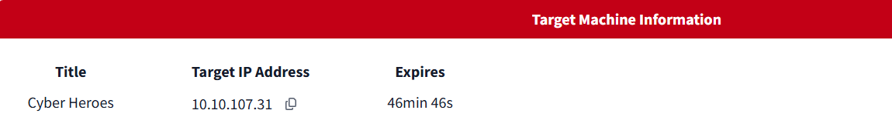


## 🔍 2. Recon

- Sử dụng `nmap` quét cổng mở trên mục tiêu.

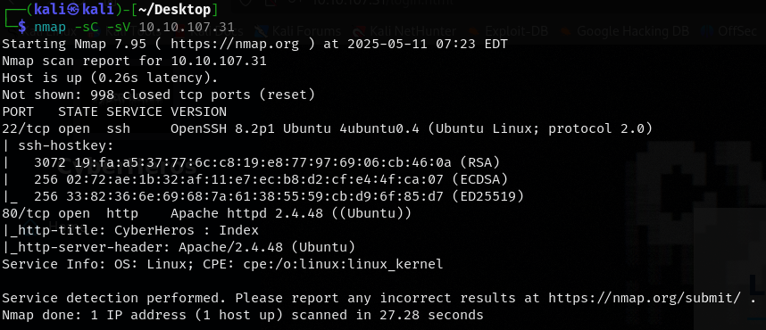

- Hai cổng được phát hiện đang mở là `22` cho dịch vụ ssh và `80` cho http.

- Truy cập trang web, đây là một trang tên `CyberHeros`.

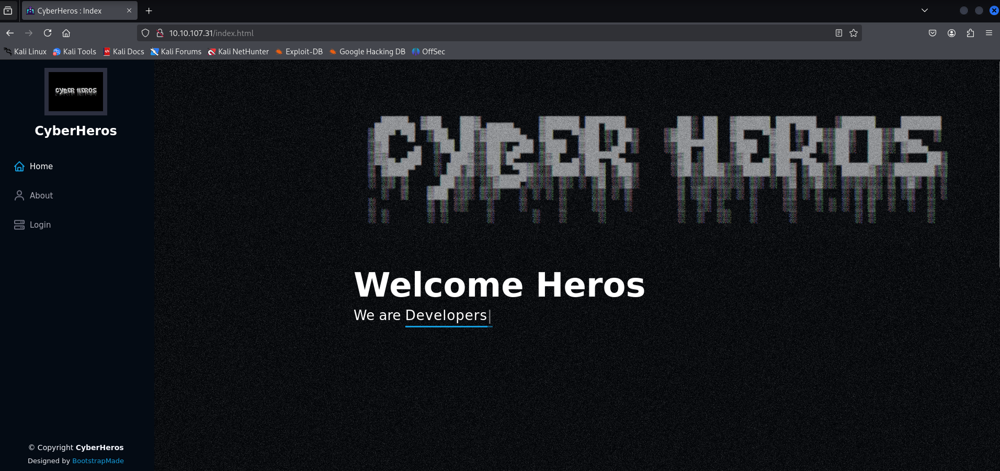

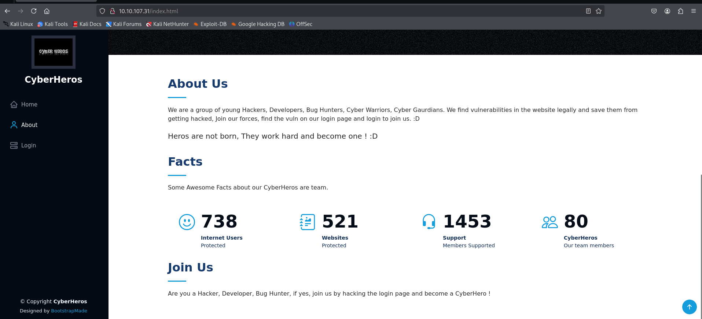

- Web này bao gồm 3 trang: `Home`, `About` và `Login`

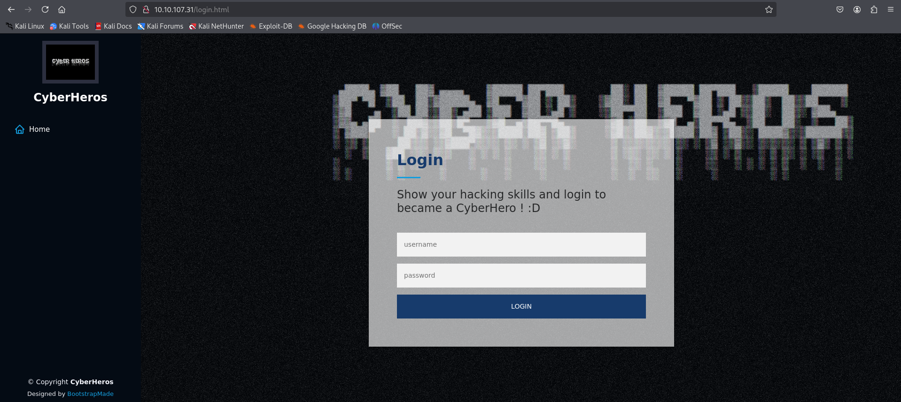

- Sử dụng `gobuster`, kiểm tra xem còn thư mục nào có thể truy cập không.

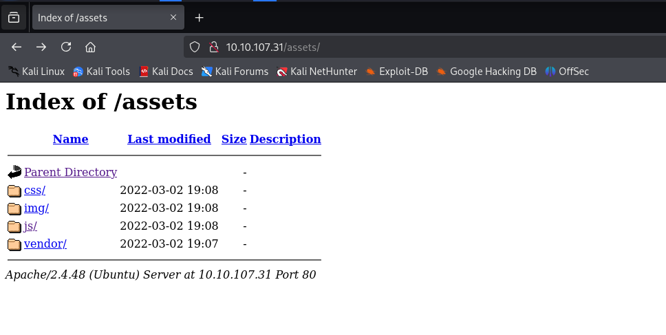

- Phát hiện `/assets`, trong đó có thể đọc được một số mã nguồn trang kể cả `js`

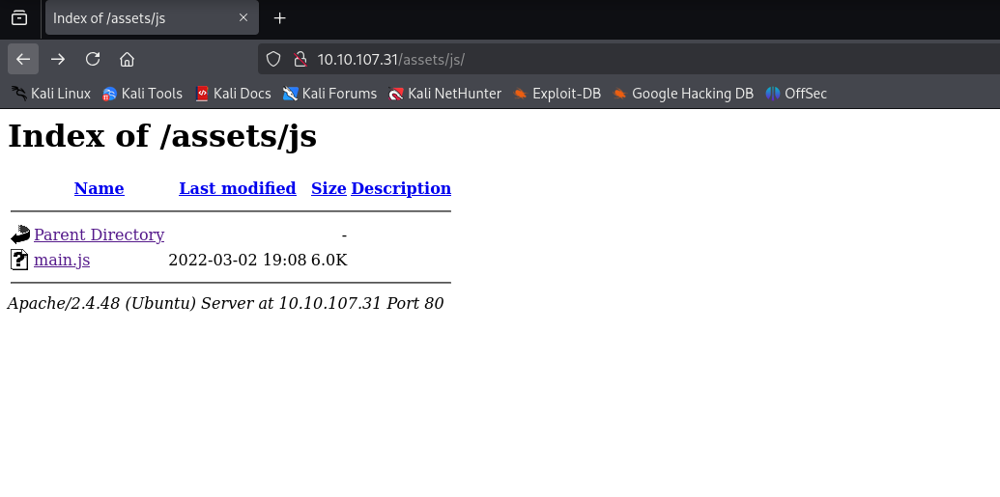

- Bên cạnh đó là file `changelog.txt`.

- Tuy nhiên vẫn chưa có ý tưởng khai thác nào từ những thông tin thu thập được


- Có lẽ mục tiêu khả dĩ nhất có thể khai thác là form `login`.

- Đọc mã nguồn trang này, phát hiện ra một đoạn mã sau:

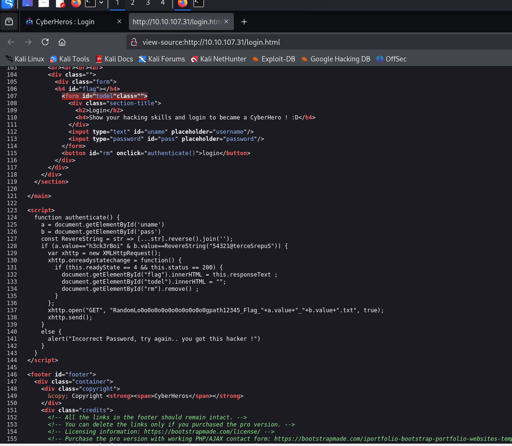

```html
  <script>
    function authenticate() {
      a = document.getElementById('uname')
      b = document.getElementById('pass')
      const RevereString = str => [...str].reverse().join('');
      if (a.value=="h3ck3rBoi" & b.value==RevereString("54321@terceSrepuS")) { 
        var xhttp = new XMLHttpRequest();
        xhttp.onreadystatechange = function() {
          if (this.readyState == 4 && this.status == 200) {
            document.getElementById("flag").innerHTML = this.responseText ;
            document.getElementById("todel").innerHTML = "";
            document.getElementById("rm").remove() ;
          }
        };
        xhttp.open("GET", "RandomLo0o0o0o0o0o0o0o0o0o0gpath12345_Flag_"+a.value+"_"+b.value+".txt", true);
        xhttp.send();
      }
      else {
        alert("Incorrect Password, try again.. you got this hacker !")
      }
    }
  </script>
```

- Đoạn mã nguồn này khá "ngớ ngẩn" khi xác thực thông qua so sánh chuỗi trực tiếp và để luôn thông tin xác thực rõ ràng trong mã nguồn.

- Dựa vào thông tin trên thì username sẽ là `h3ck3rBoi` và password là đảo ngược của chuỗi `54321@terceSrepuS`.

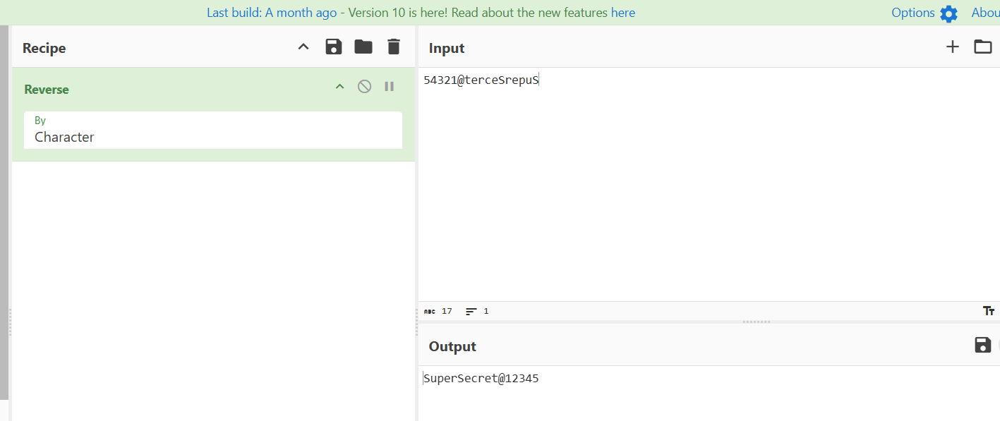

- Đảo ngược ta được `SuperSecret@12345`. Sử dụng các thông tin này để đăng nhập.

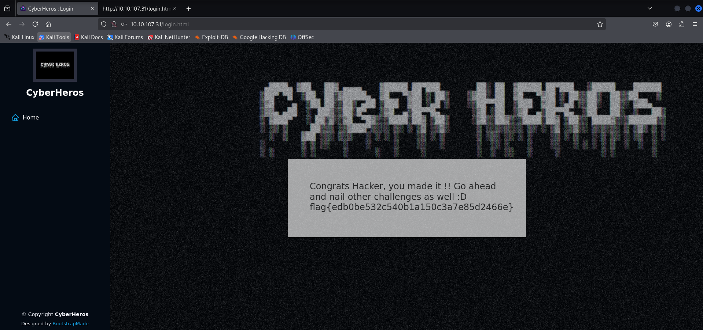

=> Thành công lấy được flag 🚩🚩

=> Hoàn thành room khá đơn giản.


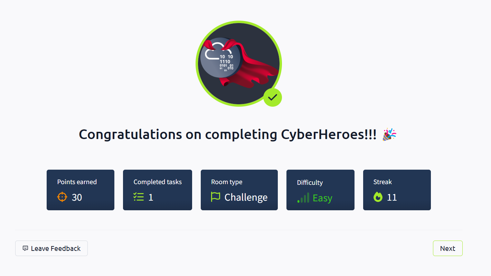


