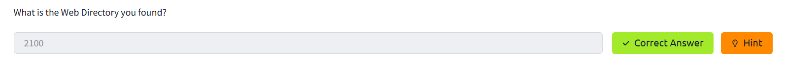

<div align="center">
    <h1>🏔️ TryHackMe Lian_yu Writeup 🌊</h1>
</div>

## 🚀 1. Khởi động taget


- Phần cuối bài sẽ sử dụng địa chỉ sau (vì phải khởi động lại :(( )


## 🔍 2. Recon

- Sử dụng `nmap` quét mục tiêu


- Kết quả trả về một số cổng mở, ngoài các cổng thường thấy như `21`, `22`, `80` thì còn có cổng `111` mở dịch vụ `RPC (Remote Procedure Call)`. Tuy nhiên ở bước này chưa thấy điều gì đặc biệt để khai thác.

- Truy cập vào trang web với giao diện `Arrowverse` (superhero universe ???)


- Giao diện trang web khá đơn giản, chỉ là lời gới thiệu về địa danh `Lian Yu` được nhắc tới và những thứ tác giả dựa trên để tạo ra room này. Mã nguồn cũng không có gì đặc biệt.

- Bước tiếp theo, dùng `gobuster` quét vì khả năng cao sẽ có thư mục ẩn.


- Tìm được một thư mục với tên `island`. Chuyển hướng tới `island`, tuy vậy trang Web đang bị thiếu mất `Code Word` nào đó.


- Xem mã nguồn thì `code word` này bị ẩn đi vì để màu là trắng, trùng với nền.


- Tìm được `vigilante`, có vẻ là tên user hoặc mật khẩu nào đó.


- Tuy nhiên với những thông tin tìm được, vẫn chưa thể khai thác thêm điều gì cũng như chưa submit thành công các câu hỏi, vậy nên tiếp tục quét thư mục ẩn.


- Phát hiện thư mục `2100`, submit thành công câu hỏi thứ nhất.



- Chuyển hướng sang `2100`, tìm được một video nhưng không thể xem được.


- Xem qua mã nguồn thì phát hiện một gợi ý liên quan đến `.ticket`, có vẻ là file ta cần tìm


- Tiếp tục sử dụng `gobuster` để quét file ẩn với đuôi là `.ticket` qua lệnh sau:

```bash
gobuster dir -u 10.10.14.242/island/2100 -w /usr/share/wordlists/dirbuster/directory-list-2.3-medium.txt -x .ticket
```

- Tìm được một file ẩn là `green_arrow.ticket`, submit thành công answer 2.


- Truy cập file, nhận được một đoạn mã `RTy8yhBQdscX`


- Sau khi tìm hiểu thì đây là đoạn mã `base58`, sử dụng `Cyberchef` để dịch lại.


- Được một đoạn mã là `!#th3h00d`, thử submit câu hỏi thứ 3 và thành công thì có vẻ đây là mật khẩu `FTP`


- Tuy nhiên chưa tìm được tên user ứng với mật khẩu này. Sau một hồi thử thì có vẻ nó là `vigilante` mà ta tìm được ở trên.

## 🔑3. Khai thác sâu hơn


- Đăng nhập, tìm được 3 file ảnh. Tải về và cùng xem có gì ẩn bên trong không.

- Vì thu được file dưới dạng `png` và `jpg` nên tôi thử sử dụng `steghide` để trích xuất dữ liệu ẩn trong các file ảnh này.

```bash
steghide extract -sf Leave_me_alone.png
```

- Tuy nhiên các file `png` thì không đúng định dạng được hỗ trợ còn file `aa.jpg` thì cần password


- Đang không biết phải làm sao thì tôi kiểm tra thử `Hex table` của ảnh `Leave_me_alone.png`.


- Phần Header có vẻ có gì đó hơi sai sai. Tìm kiếm trên `google`, tôi tìm được định dạng đúng của header này.


- Sử dụng `hexedit` và chỉnh lại cho đúng

```bash
hexedit Leave_me_alone.png
```


- Cuối cùng ta xem được ảnh hoàn chỉnh


- Hóa ra `password` chính là `password` :(((

<p align="center">
  
</p>

- Có vẻ đây là mật khẩu của file `aa.jpg`, giải mã thử.


- Thành công thu được file `ss.zip`, giải nén file này thu được 2 file là `passwd.txt` và `shado` (đoạn này tôi làm lại 2 lần nên file bị overwrite :( )

- File `passwd.txt` chứa một đoạn note mà tôi cũng chưa biết nó có s nghĩa gì :)))


- File `shado` chưa mốt đoạn text, sau khi submit thử câu hỏi thì đó có vẻ là mật khẩu `SSH`.


- Tuy vậy chưa biết `username` ứng với mật khẩu này.


- Theo gợi ý từ `passwd.txt` thử với `username` `Oliver`, tuy vậy có vẻ là không chính xác.

- Sau một hồi không biết username này là gì, thì tôi quay lại đăng nhập bằng `FTP` và phát hiện một `user` bên cạnh `vigilante` là `slade`.


- Đăng nhập thử thì boommm💥, thành công.


- Sau khi đăng nhập thành công, việc cần làm là kiếm flag 🚩, đầu tiên là `user.txt`


- Tiếp theo là root flag 🚩

- Như thường lệ, `sudo -l` xem có gì đặc biệt. Phát hiện `pkexec` có thể được chạy không password với quyền root.

- `pkexec` là một lệnh trên Linux dùng để chạy chương trình với quyền root — tương tự như `sudo`, nhưng tuân theo chính sách quyền kiểm soát của PolicyKit.


- Tìm kiếm xem có thể leo quyền với lệnh này không trên https://gtfobins.github.io/


- Chạy lệnh 

```bash
sudo pkexec /bin/sh
```


- Thành công vào được root, thành công đọc được `root.txt`.


=> Hoàn thành bài lab 🔥🔥🔥

