<div align="center">
    <h1>💡 TryHackMe Light Writeup 🗄️</h1>
</div>

## 🚀 1. Khởi động taget

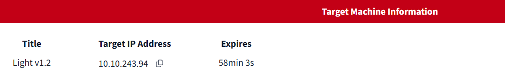

## 🔍2. Recon

- Như thường lệ, quét `nmap` để phát hiện các cổng mở.

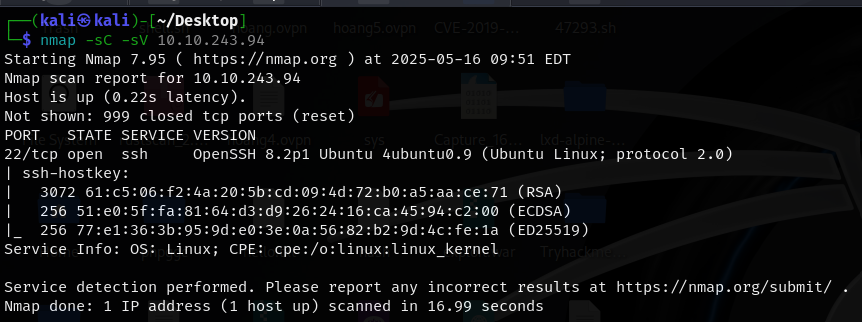

- Phát hiện cổng `22` cho SSH đang được mở.

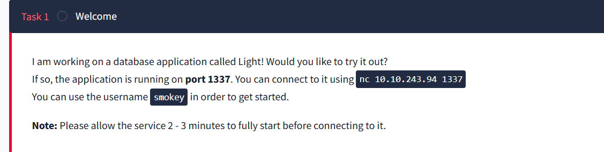

- Dựa vào gợi ý của room, sử dụng `nc` truy cập với port `1337` và username là `smokey`.

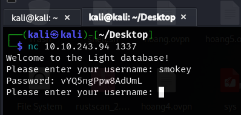

- Ta nhận được một password, tuy nhiên dùng thử password này với `ssh` thì không truy cập được.

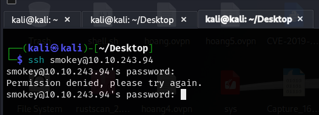

- Có lẽ mục tiêu khai thác tập trung vào việc sử dụng nc trên port `1337`.

## 🔑3. Khai thác

- Nhập thử các kí tự khác, nhận thấy có vẻ đầu vào giúp giao tiếp với database với một câu truy vấn SQL nào đó. Câu truy vấn có vẻ dạng : 
```
SELECT * FROM users WHERE username = '{user_input}' LIMIT 30; 
```

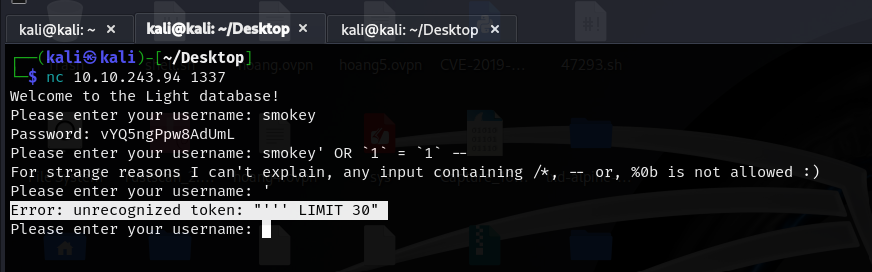

- Bộ lọc lọc một số kí tự kết thúc sớm câu truy vấn, ví dụ `#`.

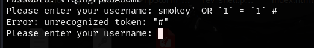

- Và có vẻ lọc cả một số keyword nguy hiểm như `Union` hay `Select`.


- Sử dụng một số cách như thay đổi các viết hoa và thường để bypass và thành công,

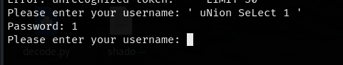


- Sử dụng một số câu lệnh để khai thác thông tin qua lỗ hổng SQL injection này.

https://github.com/swisskyrepo/PayloadsAllTheThings/blob/master/SQL%20Injection/SQLite%20Injection.md

```sql
' UniOn SeLeCt @@version '
' UniOn SeLeCt version() '
' UniOn SeLeCt sqlite_version() '
```

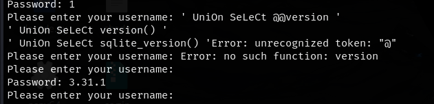

- Db được sử dụng là `SqlLite`, phiên bản `3.31.1`.

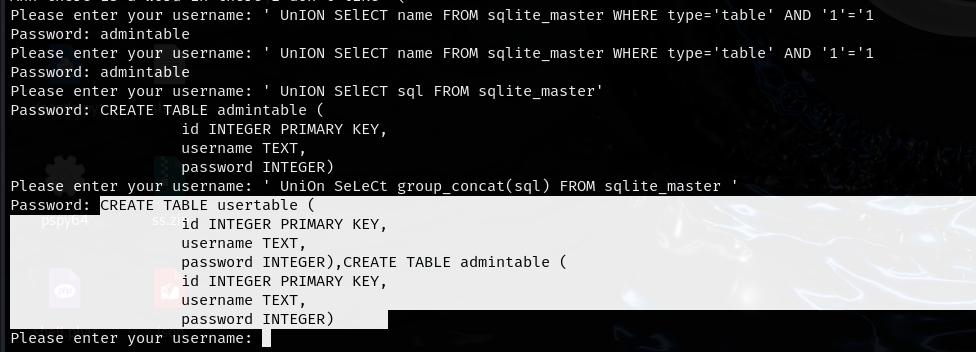

- Thu thập thông tin về các bảng.

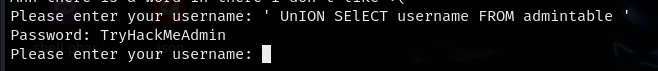

- Từ thông tin bản, tìm được các username là `TryHackMeAdmin` và `Flag`

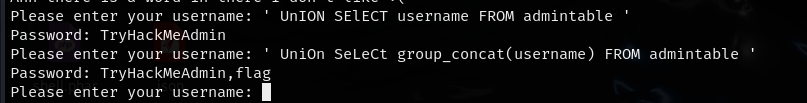


- Tìm được flag 🚩🚩🚩 và trả lời các câu hỏi.

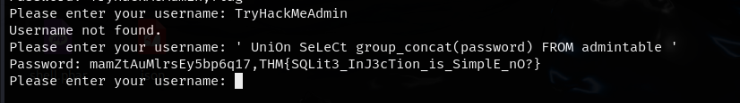

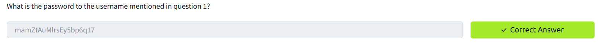

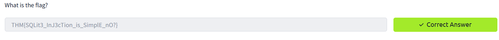

- Hoàn thành bài lab 🔥🔥🔥

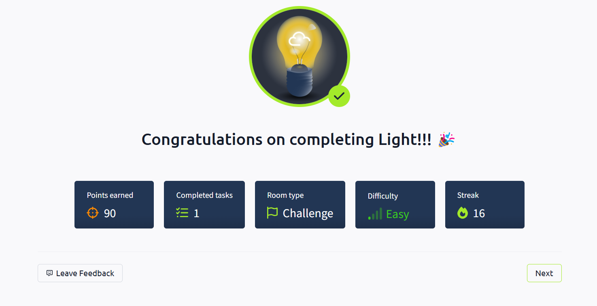

