

    <h1>🥒 TryHackMe Pickle Rick Writeup 🧠
</h1>

## 🚀 1. Khởi động taget

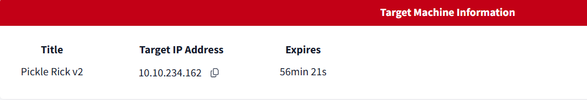

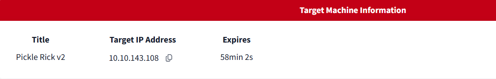

- Vì lỗi phải khởi động lại nên sử dụng đồng thời hai địa chỉ ip trên.

## 🔍 2. Recon

- Sử dụng `nmap` quét mục tiêu.

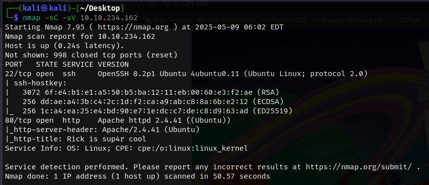

- Cổng `22` cho dịch vụ `SSH` và cổng `80` cho http được mở.

- Truy cập vào mục tiêu, nhận được một trang Web tĩnh.

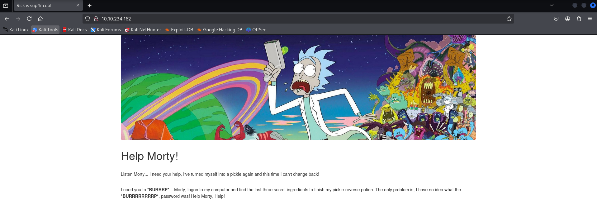

- Tiếp tục sử dụng `gobuster` để quét thư mục ẩn trên mục tiêu.

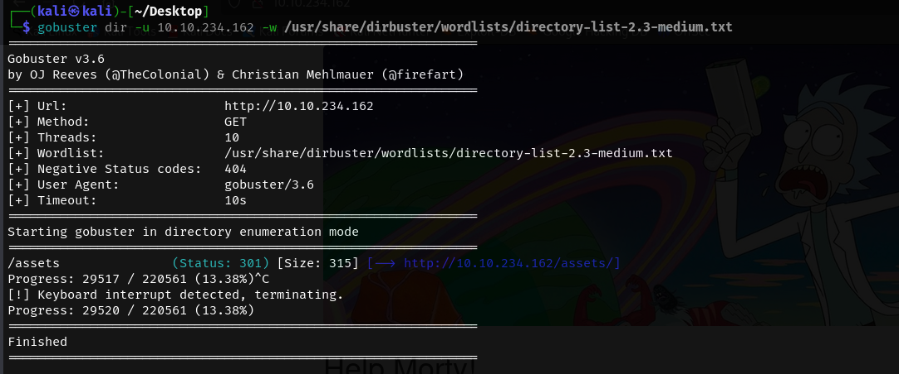

- Chỉ thu được thư mục `assets`

- Tiếp tục quét thì phát hiện file `login.php` và `robots.txt` (đoạn này tôi quên không chụp kết quả :(( )

- `login.php` là một trang đăng nhập yêu cầu `username` và `password`

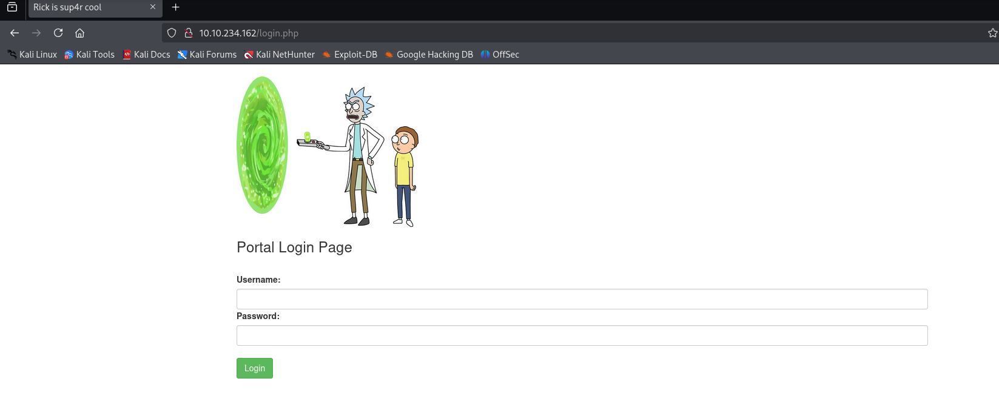

- `robots.txt` chứa một đoạn text nào đó

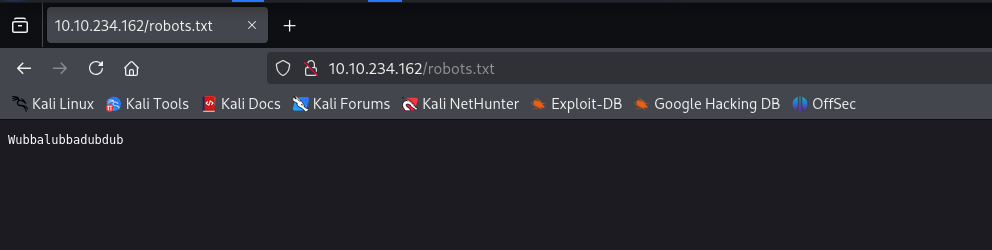.

- Từ những dữ liệu thu thập được, cố gắng khai thác sâu hơn.

## 🔑3. Khai thác

- Tôi thử tải các file ảnh tìm được từ thư mục `assets` để kiểm tra xem có file ẩn không.

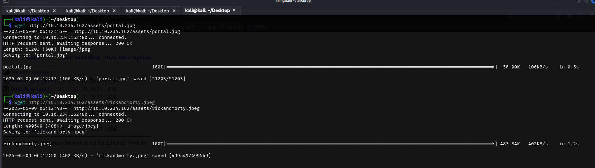

- Sau khi tiến hành kiểm tra sử dụng `steghide` và cố gắng crack mật khẩu bằng `stegcracker` thì không thu được kết quả gì, có vẻ đã đi sai hướng.

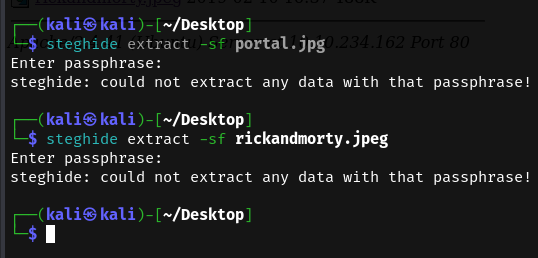

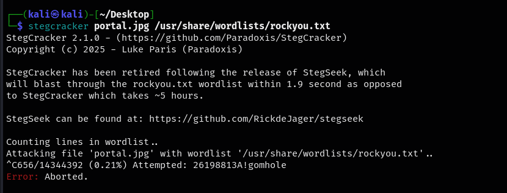

- Đọc thử mã nguồn của trang chủ trang web, thu được một đoạn comment tiết lộ username.

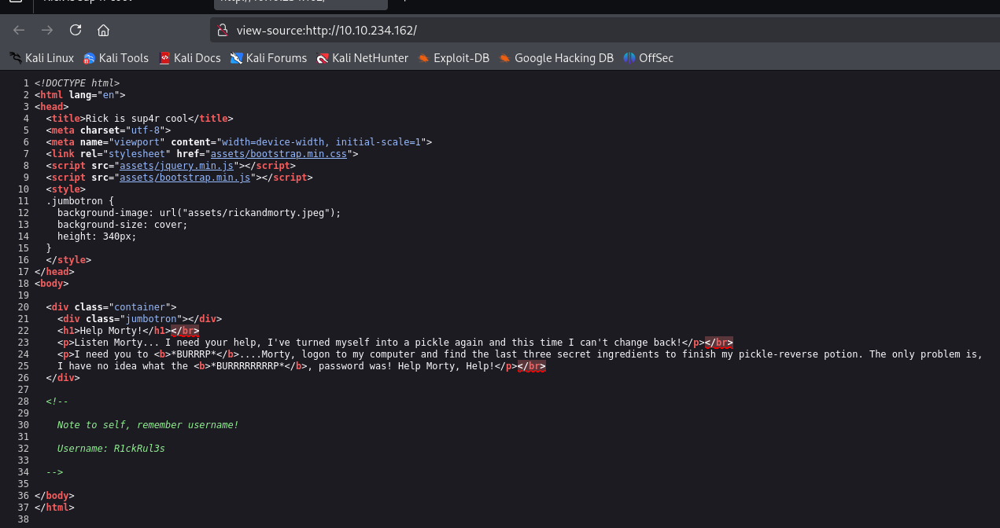

- Đến đây đã có `username`, có thể dự đoán được mật khẩu chính là đoạn text thu được trong `robots.txt`.

- Sử dụng hai thông tin trên, đăng nhập thành công vào trang `login.php`.

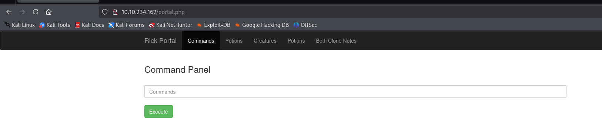

- Đăng nhập thành công, ta được cung cấp một trang cho phép nhập command. 

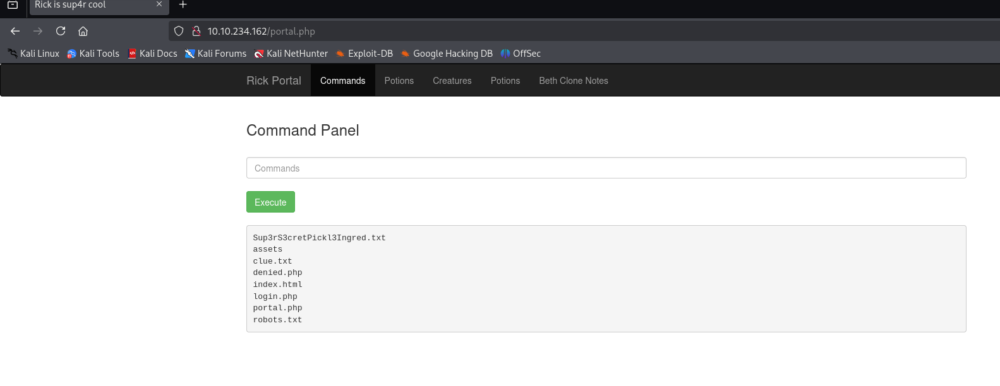

- Sau khi thực thi lệnh, kết quả được hiển thị ngay phía bên dưới.

- Tuy nhiên khi tôi sử dụng các lệnh để đọc các file dữ liệu thì không được phép.

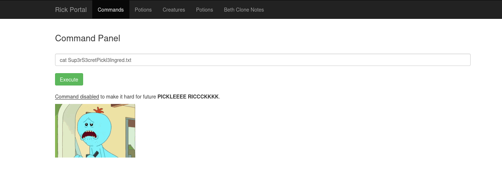

- Bên cạch đó, khi đọc mã nguồn của trang `potal.php` thì phát hiện một đoạn mã.

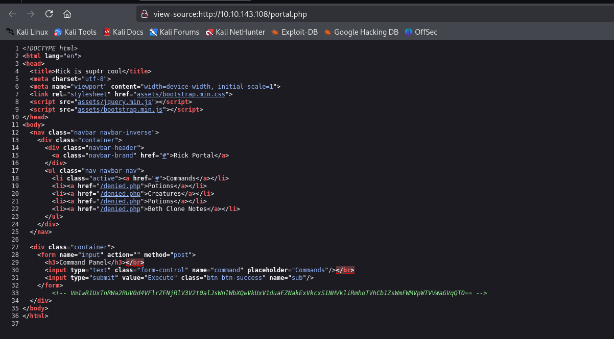

- Tuy nhiên tôi không thể giải mã đoạn mã này (Đến cuối bài lab thì đoạn mã này cũng không được sử dụng đến, nên thôi bỏ đi :)) )

- Có vẻ nên cố gắng thực một reverse shell trong trang này để có thể thoải mái hơn trong việc khai thác hệ thống.

- Sau khi thử một số reverse shell thông qua bash nhưng không thành công, kiểm tra thêm một chút thì hệ thống có cài đặt `Perl`.

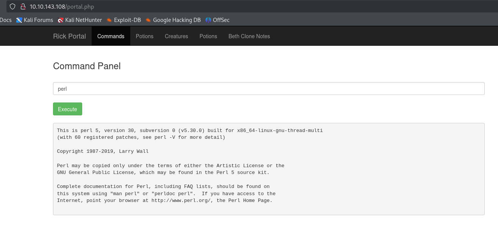

- Chèn thử shell thông qua `Perl`

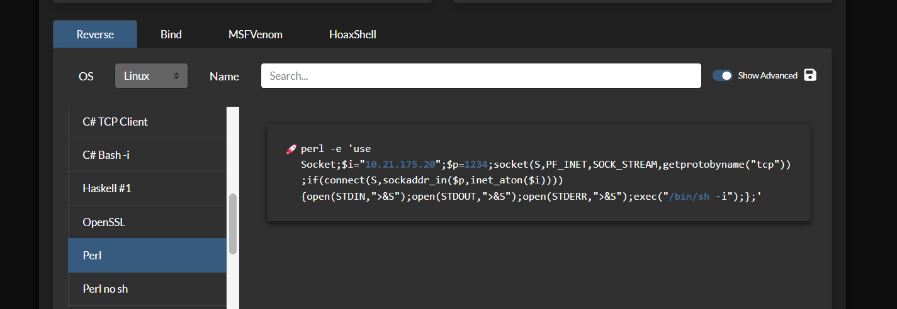

- Thành công tạo reverse shell

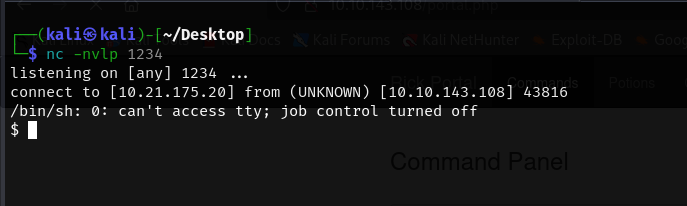

- Đọc thử file và tìm được flag đầu tiên 🚩.

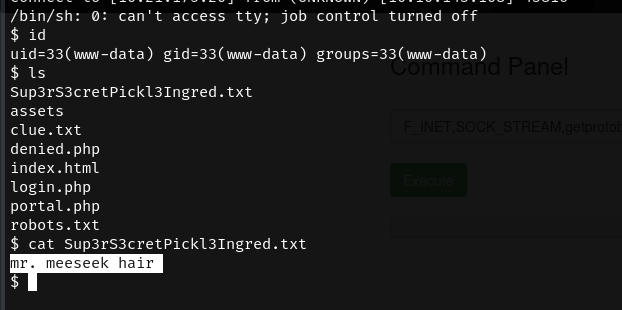

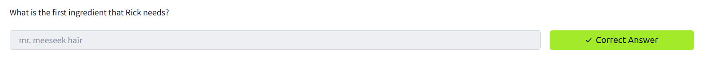

- Đọc file `clue.txt` nhưng không phải là flag ta cần tìm.

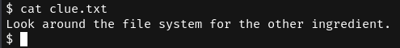

- Tìm kiếm trong `/home/rick` lấy được flag thứ 2 🚩.

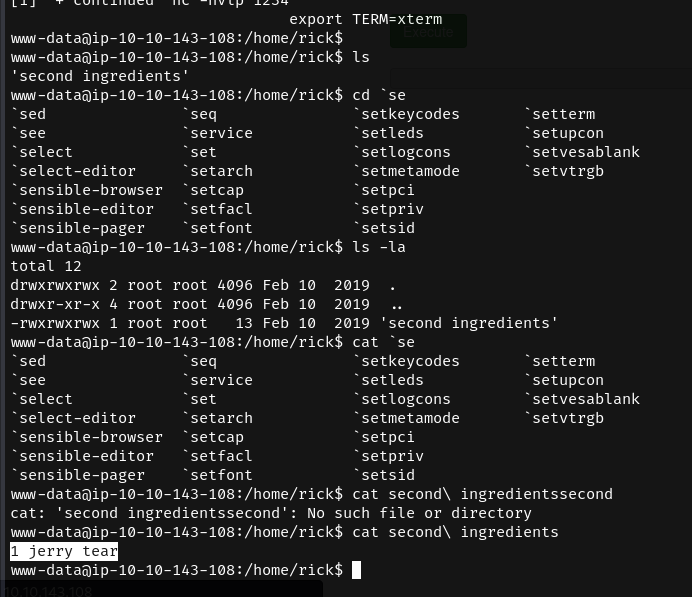

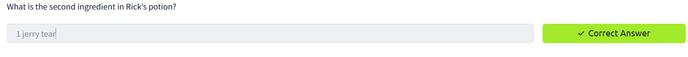

- Có vẻ cần leo lên quyền root để đọc flag cuối cùng.

- Kiểm tra quyền root sử dụng `sudo -l`, nhận thấy quyền root được thực thi mà không cần mật khẩu.

- Chuyển sang root và thành công lấy được flag cuối cùng 🚩.

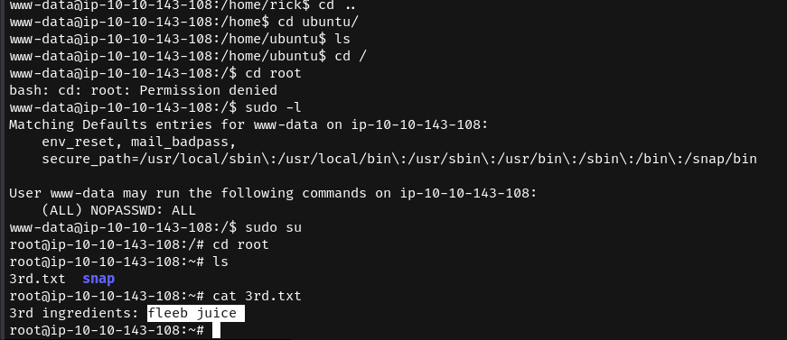

