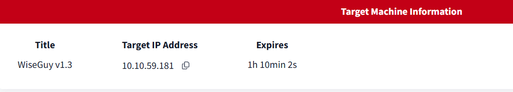
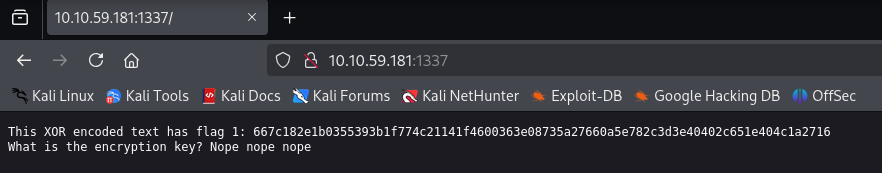
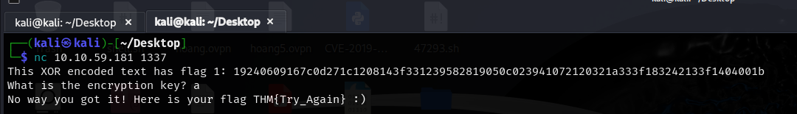
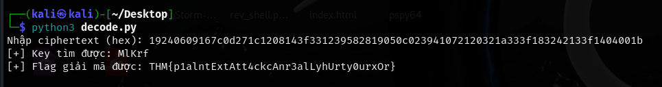
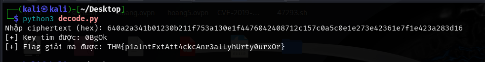
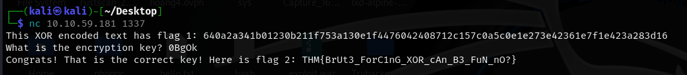
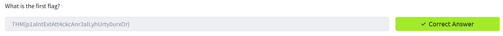
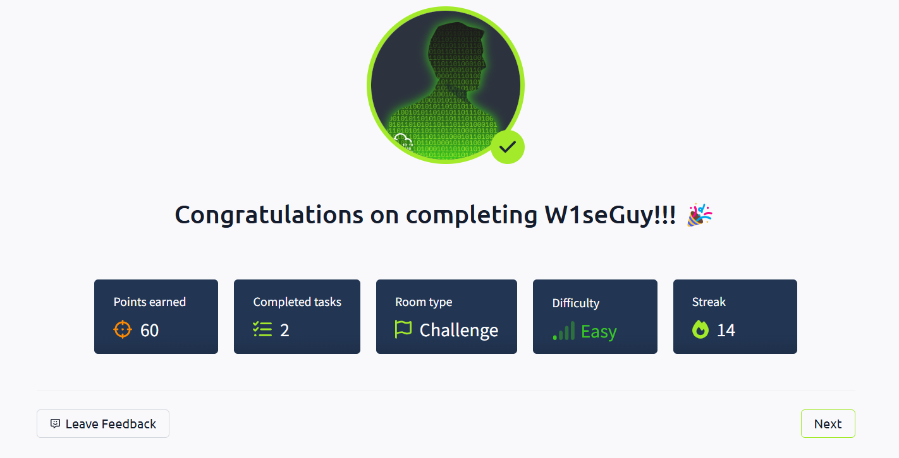

<div align="center">
    <h1> 👓 TryHackMe W1seguy Writeup 🧠</h1>
</div>

## 🚀 1. Khởi động target



## 🔍2. Khai thác

- Bài lab cung cấp mã nguồn liên quan đến việc tạo flag trên server. Theo đó nó đang nghe kết nối đến port 1337.



- Sau khi truy cập, ta nhận được một đoạn mã hóa bằng `XOR` cho flag thứ nhất.

- Cụ thể hơn, sử dụng `nc` truy cập đến mục tiêu, tại đây được yêu cầu nhập đúng `key` để giải mã mã hóa xor.



- Tại đây, có thể đoán rằng, flag được mã hóa XOR theo dạng `ciphertext = plaintext(flag) XOR key`. Để lấy được `key`, ta có thể tiến hành `XOR` ciphertext với plaintext.

- Dựa theo đoạn code, ta nhận thấy key có độ dài là 5 và được quay vòng trong quá trình mã hóa. 

```py
def start(server):
    res = ''.join(random.choices(string.ascii_letters + string.digits, k=5))
    key = str(res)
    hex_encoded = setup(server, key)
    send_message(server, "This XOR encoded text has flag 1: " + hex_encoded + "\n")
    
    send_message(server,"What is the encryption key? ")
    key_answer = server.recv(4096).decode().strip()
```
- Bên cạnh đó, flag chắc chắn có dạng `THM{}`, vì thế ta cũng biết được 4 kí tự đầu của plaintext là `THM{`.

- Từ những thông tin đó, có thể giải mã bằng các brute force kí tự thứ 5 của flag, sau đó đem `Xor` với bản mã để tìm được `key`.

- Xây dựng được đoạn code sau: 

```py
import string

def decrypt(cipher_bytes, key_bytes):
    return ''.join(chr(cipher_bytes[i] ^ key_bytes[i % 5]) for i in range(len(cipher_bytes)))

def find_full_key(cipher_hex, known_plaintext_start="THM{"):
    cipher_bytes = bytes.fromhex(cipher_hex)

    # B1: tìm 4 byte đầu của key
    key = [cipher_bytes[i] ^ ord(known_plaintext_start[i]) for i in range(4)]

    # B2: brute-force key[4]
    for c in string.printable:  # thử ký tự ASCII in được
        key_candidate = key + [ord(c)]
        plaintext = decrypt(cipher_bytes, key_candidate)

        # kiểm tra xem chuỗi trông có giống flag không
        if plaintext.startswith("THM{") and plaintext.endswith("}"):
            return ''.join(chr(k) for k in key_candidate), plaintext

    return None, None

def main():
    # Nhập ciphertext (mã hex) từ người dùng
    cipher_hex = input("Nhập ciphertext (hex): ").strip()

    # Tìm full key và giải mã flag
    key_found, flag = find_full_key(cipher_hex)

    if key_found:
        print("[+] Key tìm được:", key_found)
        print("[+] Flag giải mã được:", flag)
    else:
        print("[-] Không tìm được key hợp lệ.")

if __name__ == "__main__":
    main()
```

- Sau khi chạy đoạn code giải mã trên, ta tìm được key là `MlKrf`.



- Lưu ý, key được tạo là random nên nó có thể khác nhau mỗi lần truy cập.



- Sau khi tìm được key, thành công lấy được flag 🎉





=> Hoàn thành bài lab 🔥🔥🔥

