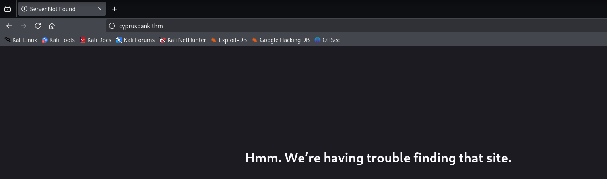
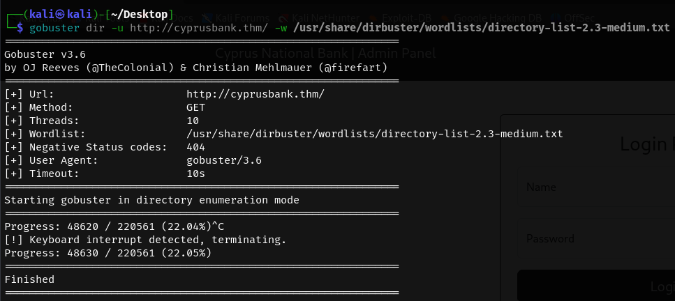
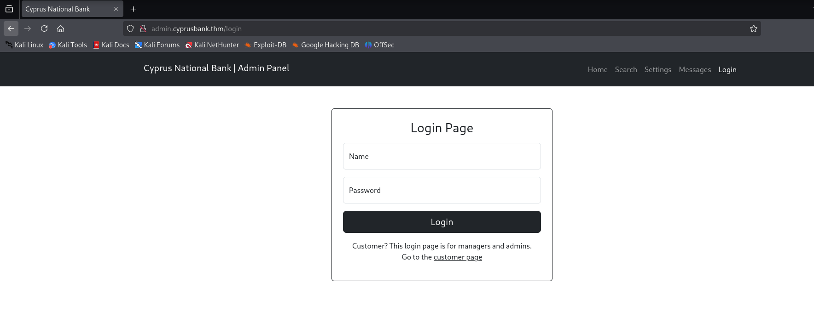
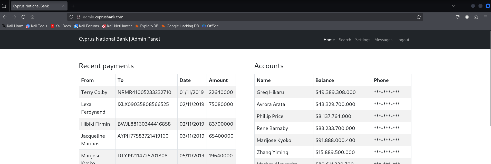
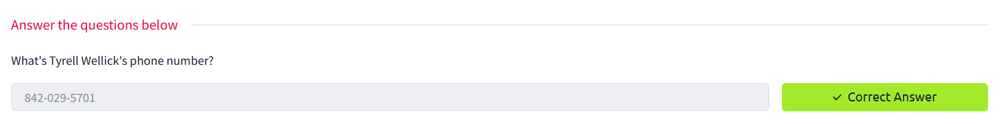

<div align="center">
    <h1>🌹 TryHackMe Whiterose Writeup 🌹</h1>
</div>


<div align="right">
    <em>📌 By: Hoàng Vũ :).</em>
</div>

## 1. Khởi động taget


## 2. Recon
```
nmap -sC -sV 10.10.178.31 
```


- Sử dụng nmap quét cổng, thấy 2 cổng mở là `22` và `80`
    - Cổng `22` mở cho dịch vụ `SSH`
    - Cổng `80` chạy máy chủ web ` nginx 1.14.0 (Ubuntu)` qua http
- Truy cập vào địa chỉ ip trang web bằng trình duyệt, thấy được chuyển hướng sang `cyprusbank.thm`.



- Thêm tên miền này vào `etc/hosts` với địa chỉ ip mục tiêu, sau đó truy cập lại.


- Sử dụng `gobuster` quét thư mục ẩn, tuy vậy có vẻ không có kết quả.

```
gobuster dir -u http://cyprusbank.thm/ -w /usr/share/dirbuster/wordlists/directory-list-2.3-medium.txt
```


- Sử dụng `ffuf` để quét subdomain.

```
ffuf -w /usr/share/seclists/Discovery/DNS/subdomains-top1million-110000.txt -u http://cyprusbank.thm/ -H "Host:FUZZ.cyprusbank.thm" -fw 1 -t 100 -mc 200,301,302
```


- Tìm được 2 subdomain là `www` và `admin`, truy cập thử vào 2 subdomain này (Lưu ý, thêm vào `etc/hosts` trước khi truy cập).

- Truy cập `http://admin.cyprusbank.thm/` trả về một `login page`



- Sử dụng thông tin được gợi ý để đăng nhập `Olivia Cortez:olivi8`
- Đăng nhập thành công, truy cập được vào một số tài nguyên của trang web, trong đó một số bị hạn chế.




## 3. Truy cập trang web
- Thử tìm kiếm tên `Tyrell Wellick`, tuy nhiên, tài khoản hiện tại có vẻ chỉ xem được thông tin `Balance` mà không xem được số điện thoại.


- Kiểm tra một lượt trang web, tại page `messages` với đường dẫn `http://admin.cyprusbank.thm/messages/?c=5` có chứa tham số `c=5` - dấu hiệu có thể bị `IDOR`


- Thử giá trị của `c` với các số khác nhau. tại `c=9`, phát hiện thông tin mật khẩu của tài khoản `Gayle Bev`


- Đăng nhập vào trang Web bằng tài khoản này, thành công lấy được số điện thoại của `Tyrell Wellick`


- Submit thành công answer 1



## 4. Truy cập web shell


