<div align="center">
    <h1>🪨 TryHackMe Whiterose Writeup 🧱 </h1>
</div>


## 🚀1. Khởi động target
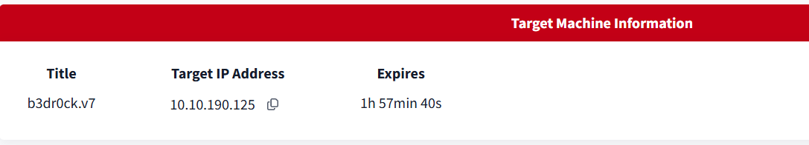

## 🔍2. Recon

```bash
rustscan -a 10.10.190.125 --ulimit 5000
```
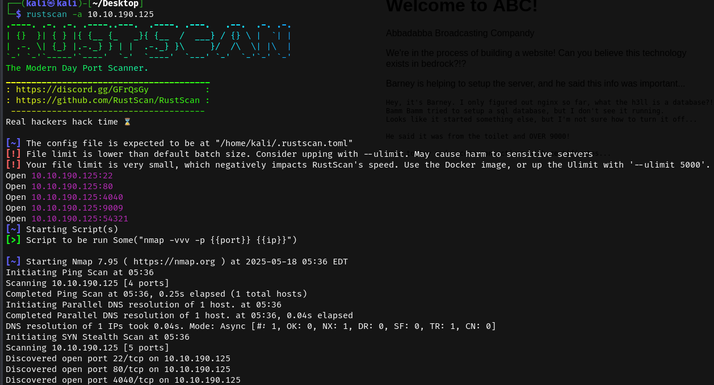

- Sử dụng `rustscan` quét cổng, nhận được một số cổng mở.

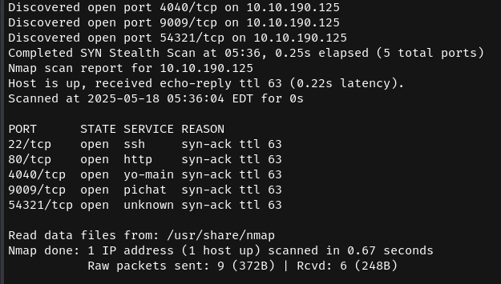

- Thêm vào đó, dựa trên các gợi ý của để bài, truy cập tới port `4040`.

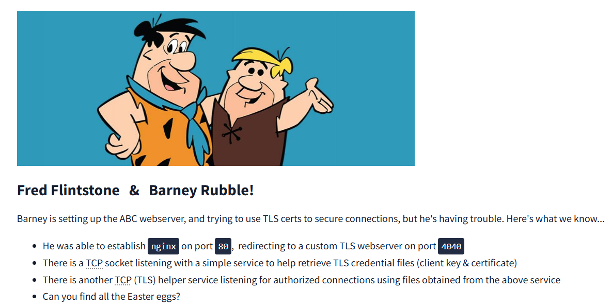

- Có gì đó trên port 9009, truy cập trực tiếp trên browser bị từ chối.

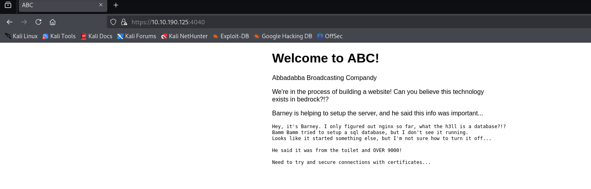

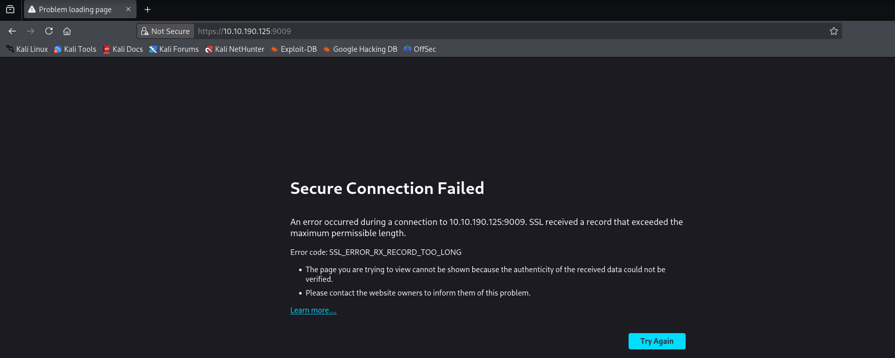

## 🔑3. Khai thác

- Truy cập bằng `nc`, nhận được một giao diện như sau.

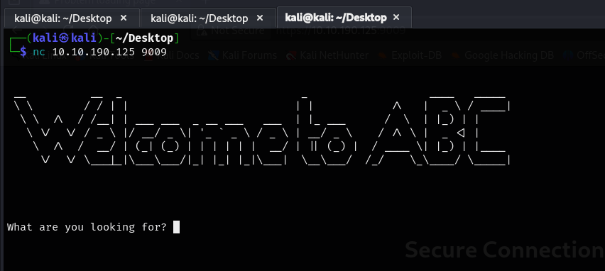

- Nhập thử một số lệnh cơ bản, tuy nhiên dịch vụ này có vẻ liên quan đến việc lấy lại `certificate` và `private key`.

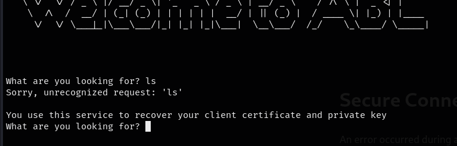

- Có vẻ ta có thể đăng nhập thông qua port `54321` sử dụng lệnh 
```bash
socat stdio ssl:10.10.190.125:54321,cert=cert,key=key,verify=0
```

- Nhưng trước tiên cần có `cert` và `key`.

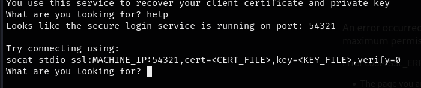

- Thành công lấy được `private key` và `certificate` từ giao diện kể trên.

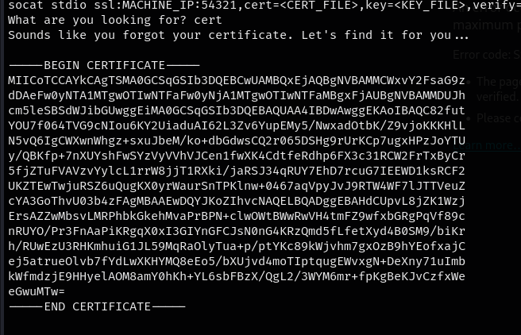

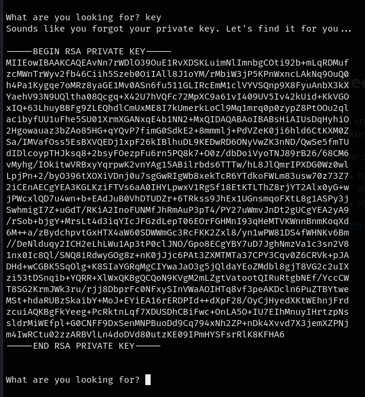

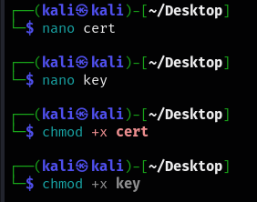

- Sau khi đã có đầy đủ thông tin, đăng nhập thành công.


- Từ đây, ta có thể lấy được mật khẩu `SSH` của user `Barney`

```
Password hint: d1ad7c0a3805955a35eb260dab4180dd (user = 'Barney Rubble')
```

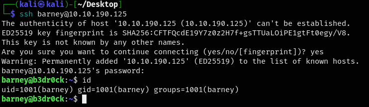

- Đăng nhập và thành công lấy được flag đầu tiên. 🚩🚩🚩

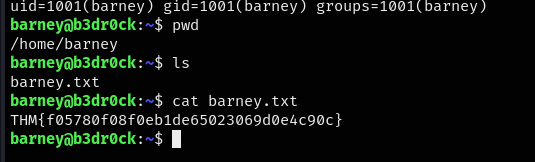

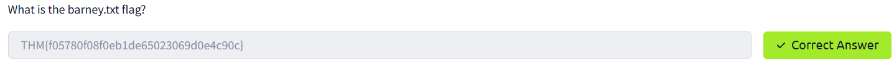

- Kiểm tra `sudo -l`, ta được run file `/usr/bin/certutil` qua root mà không cần mật khẩu

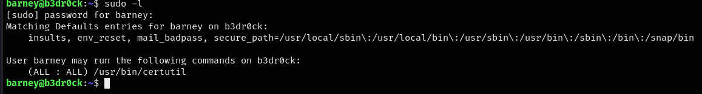

- File này cho phép ta lấy được `cert` và `key` của user `fred`, tương tự như với `barney`.

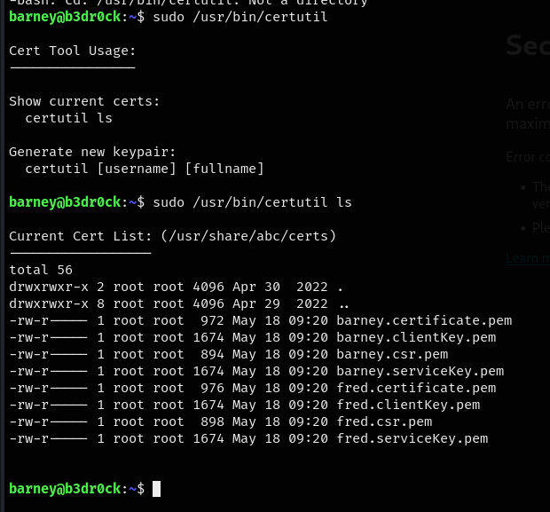

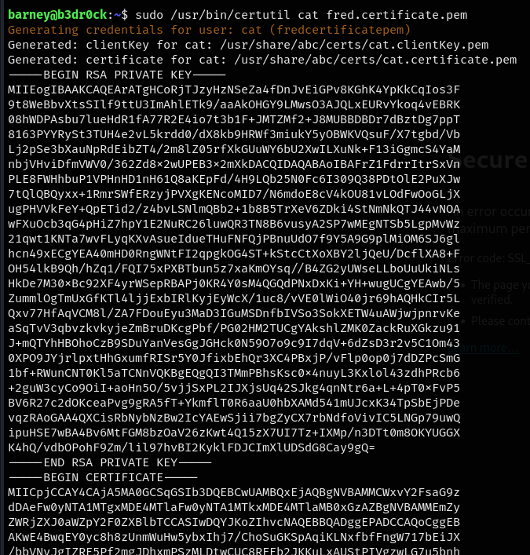

- socat đến port `54321`, thành công lấy được mật khẩu của `fred`

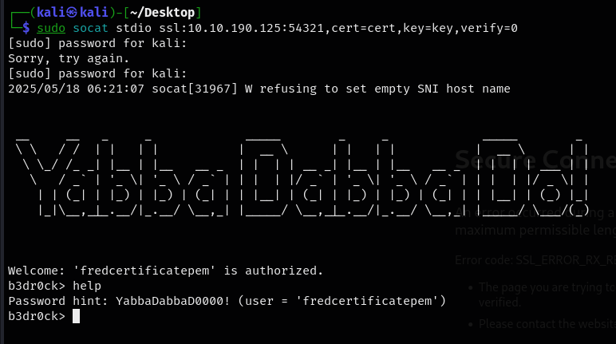

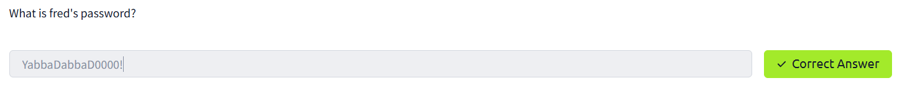


- Đăng nhập thành công qua SSH, lấy được flag tiếp theo

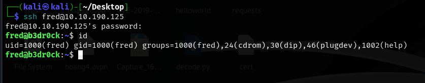

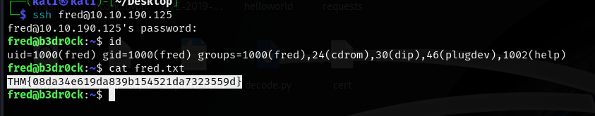

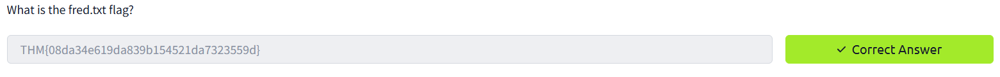

- Tiếp tục kiểm tra `sudo -l` trên tài khoản này.

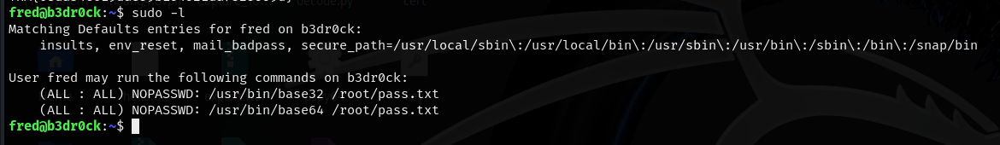

- Ta có quyền truy cập vào các file pass.txt dưới dạng base64 và base32.

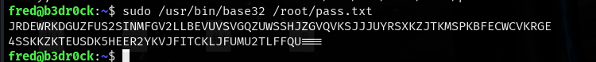

- Lấy được mật khẩu dưới dạng này, tiến hành giải mã, thu được một mã hash

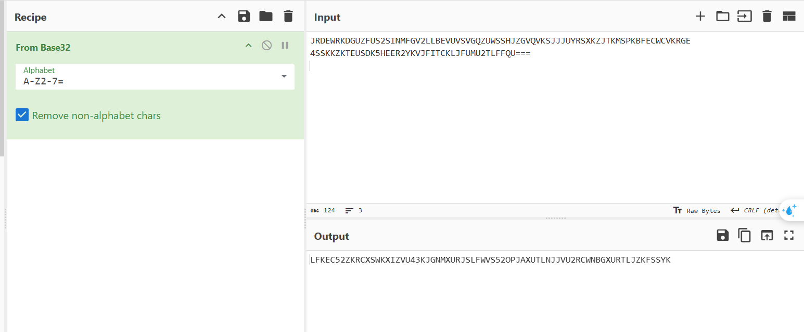

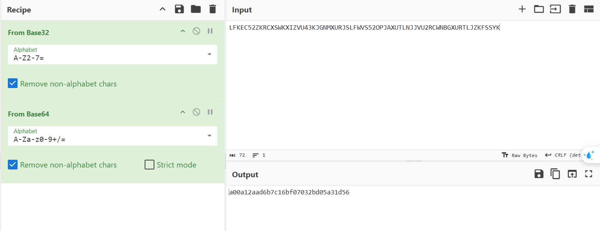

- Đây là mã hash dạng MD5

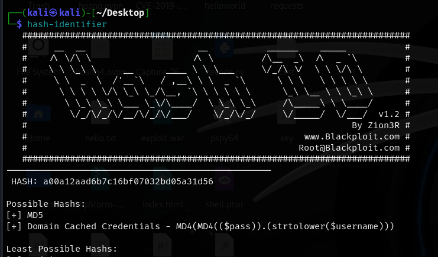

- Crack hash thành công, thu được mật khẩu `flintstonesvitamins`.

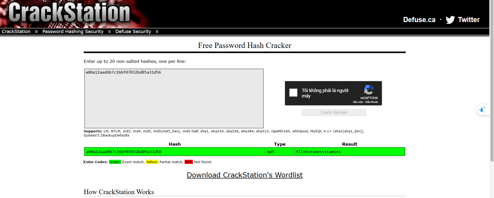

- Chuyển sang tài khoản root thành công và lấy được flag.

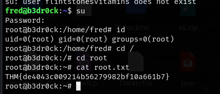

=> Hoàn thành bài lab 🔥🔥🔥

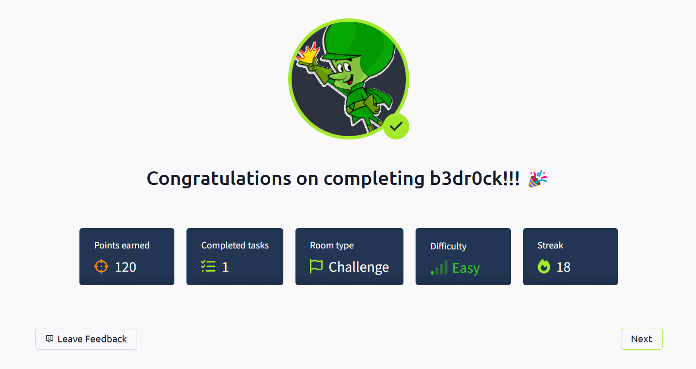